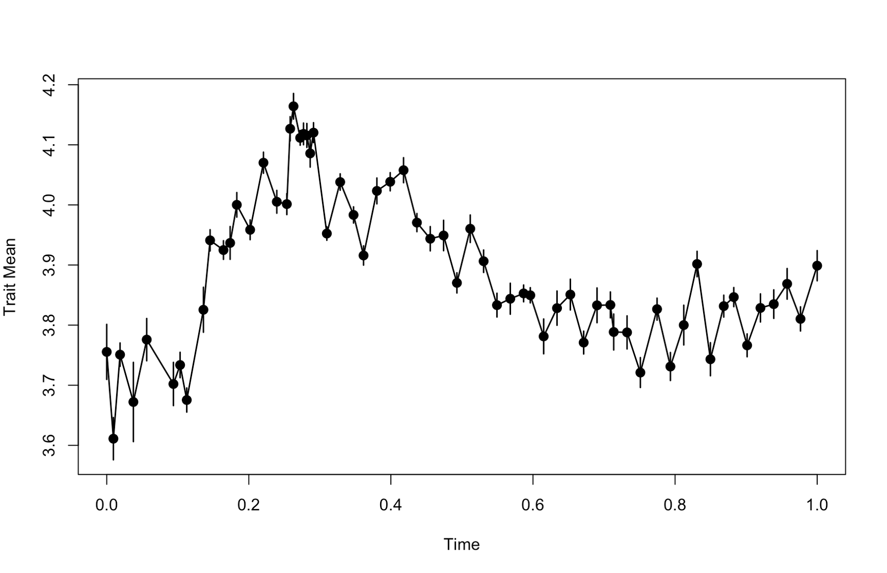
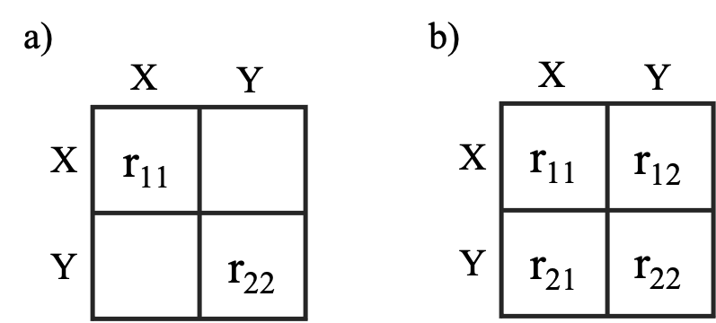
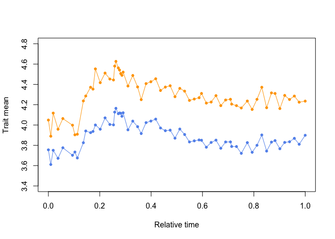
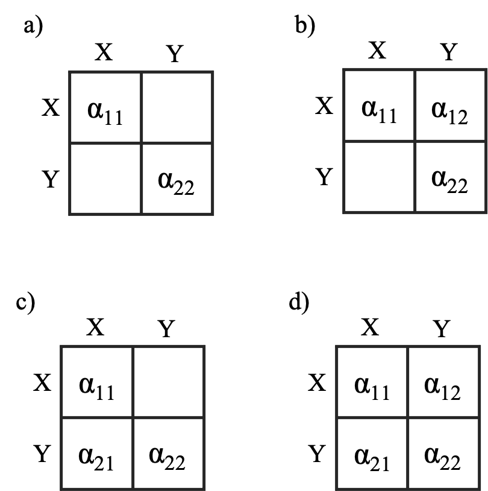

```{r, include = FALSE}
knitr::opts_chunk$set(
  collapse = TRUE,
  comment = "#>"
)
```

# 1.0 About `evoTS`
The `evoTS` package facilitates univariate and multivariate analyses of phenotypic change within lineages.

The `evoTS` package extends the univariate modeling framework implemented in the <a href="https://cran.r-project.org/web/packages/paleoTS/index.html">`paleoTS` package</a> (Hunt 2006; 2008a; 2008b; Hunt *et al.* 2008; 2010; 2015) and has been developed to mirror the user experience from `paleoTS` as much as possible. For example, all univariate models implemented in `evoTS` are fitted to a `paleoTS` object, i.e., the data format used in `paleoTS`. The fit of all univariate models available in `paleoTS` and `evoTS` are directly comparable. 

`evoTS` contains a range of multivariate models, including different versions of multivariate unbiased random walks and Ornstein-Uhlenbeck processes. Together, these models allow the user to test various hypotheses of trait evolution, e.g., whether traits change in a correlated or uncorrelated manner, whether one trait/variable affects the optimum of a second trait (Granger causality), whether adaptation in different traits happen independently toward fixed optima etc. 

`evoTS` also contains functions for calculating the topology of the likelihood surfaces of fitted models, a useful feature to investigate the range of parameter values with approximately equal likelihood as the best parameter estimates.

<br />
<br />

## 1.1 Compatibility with `paleoTS` **(technical info)**
The models implemented in `evoTS` build on the same assumptions as the models available in the `paleoTS` package: all models assume the population (sample) means in the sequence of ancestor-descendants have a joint distribution that is multivariate normal with an expected mean vector and covariance matrix that are functions of the parameters of each model, the time intervals separating the populations (samples) in the sequence, and the sampling variances of the trait means. Given the assumption of multivariate normality, the expected distribution of sample means is given by their first, second, and mixed moments (covariance). As in the `paleoTS` package, `evoTS` use the built-in optimization routines in R for estimating maximum likelihood parameter estimates. The default hill-climbing optimization technique used in all univariate models (L-BFGS-B) is a quasi-Newton method that constrains the optimization of certain parameters (e.g., so that variance parameters cannot be smaller than 0). All multivariate models use the Nelder-Mead hill climbing search algorithm as default. 

All models in `evoTS` have been implemented using the joint parameterization routine from the `paleoTS` package. The optimization is therefore fit using the actual sample values, with the autocorrelation among samples accounted for in the log-likelihood function. 

In `evoTS`, as in the `paleoTS` package, the default setting when fitting models is that the sample variance is pooled across all samples/populations. Pooling sample variance makes sense when the sample size is low for some or many of the samples/populations in a time series. Pooling sample variance allows for estimating a more precise sample/population variance common for all samples/populations in stead of relying on each separate estimate of a sample/population variance. There may be circumstances when estimating a pooled sample/population variance is not necessary (e.g., if sample size is high for all samples/populations) or beneficial (the hypothesis being tested demands individually estimated sample variances). Whether sample variances are pooled or not is controlled by setting `pool = TRUE` or `FALSE` when fitting models in `evoTS.`

Relative model fit in `evoTS` is evaluated based on the small sample-corrected version of the AICc (Akaike 1974; Burnham and Anderson 2002). 

<br /> 
<br /> 

# 2.0 Installation

The `evoTS` package is available on GitHub and can be installed using devtools:
<br /> 
```{r eval = FALSE}
> install.packages("devtools")

> devtools::install_github("klvoje/evoTS")

> library(evoTS)
```
<br /> 
The package will soon be available on CRAN.
<br /> 
<br /> 

# 3.0 Getting data into `evoTS`
An object of class `paleoTS` is the required input for most of the functions in `evoTS`. To create a `paleoTS` object, you need vectors of trait means, sample/population variances, sample sizes and ages of the samples/populations. 

One easy way to create a `paleoTS` object is to use the `as.paleoTS` function from the `paleoTS` package. 
<br /> 
```{r eval = FALSE}
## Creating example data 
> trait_means<-rnorm(20)
> trait_variance<-rep(0.5,20)
> sample_size<-rep(30,20)
> time_vector<-seq(0,19,1)

# Create paleoTS object
> indata.evoTS<-paleoTS::as.paleoTS(mm = trait_means, vv = trait_variance, nn = sample_size, tt = time_vector)
````
<br /> 
Another way to get data into `evoTS` is to use the function `read.paleoTS` from the `paleoTS` package. This function imports data from a text file with four columns corresponding to sample sizes, trait means, sample/population variances, and ages of the samples/populations (in that order) and converts the input to a `paleoTS` object. 

See also the `paleoTS` ([vignette](https://cran.r-project.org/web/packages/paleoTS/vignettes/paleoTS_basics.html)) for more info on how to import data and create a `paleoTS` object.

## 3.1 Data included in `evoTS`
Two evolutionary sequences (time-series) of phenotypic change are included in the `evoTS` package. The data are from the diatom lineage *Stephanodiscus yellowstonensis*  and were originally published in Theriot *et al.* (2006). Each trait consists of 63 samples spanning almost 14 000 years of phenotypic change. 

We will use these data to illustrate many of the functions implemented in `evoTS.` 

We first investigate phenotypic change in the diameter of *S. yellowstonensis*. The diameter has been measured in micrometers, but we are interested in investigating proportional changes in the trait. We therefore first do an approximate log-transformation of the data. We then convert the time vector in the data set to unit length (i.e., the length in time from the oldest to youngest sample/population in the data set becomes 1). Such a linear transformation of the time vector does not change how the estimated parameters describe the evolutionary dynamics in the data, but ease parameter estimation and interpretation of certain model parameters. We also plot the data to have a look at the phenotypic changes.
<br /> 
```{r eval = FALSE}
## Doing an approximate log-transformation of the data
> ln.diameter<-paleoTS::ln.paleoTS(diameter_S.yellowstonensis)

## Convert the time vector to unit length
> ln.diameter$tt<-ln.diameter$tt/(max(ln.diameter$tt))

## Plotting the data
> plotevoTS(ln.diameter)
````
<br /> 
```{r  out.width = "100%", echo = FALSE, fig.align="center"}
 
```
<br /> 

# 4.0 Univariate models in `evoTS`
The `evoTS` package contains a range of univariate models that expand and supplement the models available in `paleoTS.` 

The `paleoTS` package contains functions to fit biased (GRW) and unbiased random walks (URW), stasis (modeled as a white noise process, i.e., uncorrelated variation around a constant mean), strict stasis (no real evolutionary change) and an Ornstein-Uhlenbeck (OU) processes assuming a fixed optimum (see Hunt 2006 and Hunt *et al.* 2008 for info on these models). The `paleoTS` package also contains models of a punctuated mode of evolution where punctuations (jumps in phenotype space) separate different parameterizations of the stasis model (Hunt 2008). A few other mode shift models (where the model of evolution shifts at some point during the evolutionary sequence) has also been implemented in `paleoTS` (Hunt 2008; Hunt *et al.* 2015).

The following univariate models have been implemented in the `evoTS` package:

1.	A decelerated-evolution model (an unbiased random walk with an exponential decrease in the rate of change over time)

1.	A accelerated-evolution model (an unbiased random walk with an exponential increase in the rate of change over time)

1.	Ornstein-Uhlenbeck processes where the optimum changes according to an unbiased random walk. 

## 4.1 Decelerated-evolution model
The unbiased random walk model in the `paleoTS` package model evolutionary changes as random draws from a normal distribution with a mean of zero (Hunt 2006). Each draw from the normal distribution represents a discrete evolutionary "step" and the variance of the normal distribution is called the step variance. The decelerated model of phyletic evolution is an unbiased random walk where the step variance is reduced exponentially through time (Voje 2020). This model is closely related to the early burst model developed for phylogenetic comparative data (e.g., Harmon *et al.* 2010, Cooper and Purvis 2010), but describes a reduced rate of evolution with time within a lineage and not within a clade. As for the random walk model (Hunt 2006), the expected evolutionary divergence between ancestor and descendant populations is always zero in the model of decelerated evolution. The expected trait mean and its variance and covariance are given by the following expressions:
<br />
<br />

$$ E[z_{i}] = z_{0} $$
<br />

$$ Var[z_{i}] = \sigma ^{2} _{step.0}e^{rt_i} + \epsilon _{i} $$
<br />

$$ Cov[z_{i},z_{j}] = \sigma ^{2} _{step.0}e^{rt_{min}} $$
<br />

where $z_{i}$ is the expected trait value for population *i* in the time series, $z_{i}$ is the ancestral trait mean, $\sigma ^{2} _{step.0}$ is the initial value for the step distribution, $r$ describes the exponential decay in the $\sigma ^{2}_{step.0}$ through time and is constrained to be 0 or smaller, $t_{i}$ is the time interval from the ancestral population mean (the start of the fossil sequence, which has a time of 0) to the *i*th population, and $t_{min}$ is the time interval from the ancestral population to the oldest of the two populations $z_{i}$ and $z_{j}$.

The decerelated model of evolution can be fitted to a time series using the `opt.joint.decel` function.
<br /> 
```{r eval = FALSE}
> opt.joint.decel(ln.diameter)
$logL
[1] 76.77642

$AICc
[1] -147.1461

$parameters
       anc      vstep          r 
 3.8868739  0.2892461 -1.8076302 

$modelName
[1] "Decel"

$method
[1] "Joint"

$se
NULL

$K
[1] 3

$n
[1] 63

attr(,"class")
[1] "paleoTSfit"
```
<br /> 
The output returns the log-likelihood of the model parameters (*logl*), the AICc score (*AICc*), the number (*K*) of estimated parameters (*parameters*), the length of the analysed time-series (*n*), the model name (*modelName*) and the method used to parameterize the model (*method*). *anc* is the estimated ancestral trait value, *vstep* is the initial value for the step distribution, and *r* describes the exponential decay in the *vstep* parameter through time. 

The time it takes to half the rate of evolution can be calculated based on the value of *r* using $-ln(2)/r$. The half-life parameter is interpreted based on the time-scale used when analyzing the data. Since time from start to end in our data has been scaled to unit length, the estimated half-life represent the percent of the total length of the time-series it takes for the rate of evolution to half. The half-life is (-ln(2)/-1.8076302 =) 0.38 in this example. The total length of the analyzed time-series is 13,728 years, which means it takes (13,728*0.38 =) 5,217 years for the rate of evolution to be reduced by 50%.

What are the uncertainty of the estimated parameters in this model? Standard errors of the parameters are returned by setting `hess = TRUE` when fitting a model. The standard errors are calculated based on the Hessian matrix, which is a square matrix of partial second order derivatives.

Another way to assess the uncertainty of the estimated parameters is to explore the likelihood-surface of the fitted model.

Investigating the likelihood surface can be helpful for several reasons. 

1. Computing the likelihood surface is a great way to explore which parameter combinations that have an almost identical likelihood compared to the maximum likelihood values. Investigating the log-likelihood surface is also an approach to assess uncertainty in the estimated parameters. A large range of parameter values that have almost the same log-likelihood is an indication that we should be careful putting too much emphasis on only the maximum-likelihood (best) estimates of the parameters. The functions in `evoTS` calculating log-likelihood surfaces report the upper and lower parameter estimates that are within two support units of the best estimate as a way to assess uncertainty in parameters (Edwards 1992). While standard errors computed from the Hessian matrix are always symmetric around the point estimate, the log-likelihood surface might not be (multivariate) normal. The reported upper and lower parameter estimates are therefore often not symmetrical around the maximum likelihood parameter estimates.

1. Estimating parameters in a model using maximum likelihood always run the risk of returning parameters from a local and not a global optimum in the likelihood landscape. Investigating the support surface for combinations of parameters is one way to explore the topology of the likelihood-surface. 

1. Ridges in the log-likelihood surface can make it challenging to identify maximum likelihood estimates of the model parameters in certain cases. Flat ridges may for example cause identifiability issues and problems for the model to converge. Investigating the log-likelihood surface can therefore help diagnose challenges related to failures of models convergence.  

The `evoTS` package contain functions to create likelihood surfaces for univariate models in `evoTS` and `paleoTS` (e.g., `loglik.surface.stasis`, `loglik.surface.URW`, `loglik.surface.GRW`, `loglik.surface.OU`). These functions need a `paleoTS` object and vectors containing candidate values for the parameters to be evaluated. Which candidate values to investigate is trial-and-error, but the maximum likelihood estimate of the parameter should always be in the interval. 

For the decelerated model of evolution, the vectors given to the arguments `vstep.vec` and `r.vec` define the pairwise combinations of parameters for which the function will estimate the log-likelihood. The resolution of the input vectors therefore determines how accurate the visual representation of the support surface is, including the returned upper and lower estimates printed in the console. A higher resolution gives better precision, but demands more computation time. Note that the computed support surface is conditional on the best estimates of the other model parameters that are not part of the support surface (e.g., the estimated ancestral trait value is assumed to be 3.8868739 in the example below).

One way to define the candidate values is to use the `seq` function.
<br /> 
```{r eval = FALSE}
> loglik.surface.decel(ln.diameter, vstep.vec = seq(0,1.2,0.01), r.vec = seq(-5,0,0.01))
      lower upper
vstep  0.17  1.00
r     -3.70 -0.28
```
<br /> 
```{r  out.width = "80%", echo = FALSE, fig.align="center"}
knitr::include_graphics("decel_logl_surface.png") 
```
<br /> 
From the likelihood surface and from the printed confidence intervals, we see that *r* values between -3.70 and -0.28 are within 2 log-likelihood units from the best estimate for this parameter. This suggests we should be careful to exclude the possibility that the half-life of the decay in the rate of evolution is as much as 248% (34,045 years) or as low as 19% (2,608 years) of the investigated time-interval.

## 4.2 Accelerated-evolution model
The accelerated evolution model is identical to the decelerated model except that the r parameter is constrained to be 0 or larger, which means the rate of evolution is accelerating with time. 

The accelerated evolution model can be fitted using the `opt.joint.accel` function.
<br /> 
```{r eval = FALSE}
> opt.joint.accel(ln.diameter)

$logL
[1] 73.80287

$AICc
[1] -141.199

$parameters
      anc     vstep         r 
3.7078973 0.7903365 0.2630122 

$modelName
[1] "Accel"

$method
[1] "Joint"

$se
NULL

$K
[1] 3

$n
[1] 63

attr(,"class")
[1] "paleoTSfit"
```
<br /> 
The accelerated evolution model has a lower (worse) log-likelihood and higher (worse) AICc score compared to the decelerated model of evolution. 

A support surface can be produced using the `loglik.surface.accel` function.
<br /> 
```{r eval = FALSE}
> loglik.surface.accel(ln.diameter, vstep = seq(0,5,0.01), r.vec = seq(0,1.5, 0.005))
      lower upper
vstep 0.090  5.00
r     0.035  1.35
```
<br /> 
```{r  out.width = "80%", echo = FALSE, fig.align="center"}
knitr::include_graphics("accel_logl_surface.png") 
```
<br /> 
The 3D plot can be rotated vertically and horizontally to get a better overview of the likelihood surface, which is why the observation angle is different for this 3D plot compared to the 3D plot for the decelerated model. 


## 4.4 Ornstein-Uhlenbeck model with moving optimum.
An Ornstein-Uhlenbeck model describes the evolution of a trait towards an optimum. The `paleoTS` package includes an Ornstein-Uhlenbeck (OU) model of evolution with a single, fixed optimum (Hunt *et al.* 2008), portraying evolutionary adaptation of a trait towards a fixed peak on the adaptive landscape. However, peaks in the adaptive landscape might not be fixed and the `evoTS` package contains functions to fit OU models where the optimum (peak) is constantly changing position according to an unbiased random walk. Such a model was proposed by Hansen *et al.* (2008) for analyses of phylogenetic comparative data. Adjusted to describe phenotypic evolution within a single lineage, the expected trait mean and its variance and covariance are given by the following expressions:
<br /> 
<br /> 
$$E[z_{i}] = e^{(-\alpha t_{i})}z_{0} + (1-e^{-\alpha t_{i}})\theta$$
<br /> 
$$Var[z_{i}] =\left[ \frac{ \sigma^{2}_{step}+\sigma^{2}_{\theta}}{2\alpha} \right] \left( 1-e^{(-2\alpha t_{i})}\right) + \sigma^{2}_{\theta}t_{i} \left[  1-2(1-e^{-\alpha t_{i}}) /\alpha t_{i}\right] + \epsilon _{i} $$
<br /> 
$$Cov[z_{i},z_{j}] =\left[ \frac{ \sigma^{2}_{step}+\sigma^{2}_{\theta}}{2\alpha} \right] \left( 1-e^{(-2\alpha t_{a})}\right)e^{-\alpha t_{ij}} + \sigma^{2}_{\theta}t_{a} \left[  1-\left(1+e^{-\alpha t_{ij}} \right) \left( 1-e^{-\alpha t_{a}} \right) /  \alpha t_{i}\right]$$
<br /> 
where $z_{i}$ is the expected trait value for the *i*th sample, $z_{0}$ is the ancestral trait mean, $t_{i}$ is the time interval from the ancestral population mean (the start of the time-series, which has a time of 0) to the *i*th sample, $\theta$ is the optimum, $\alpha$ measures the rate of adaptation to the optimum, $\sigma^{2}_{step}$ is the variance of the stochastic perturbations of *z*, and $\sigma^{2}_{\theta}$ is the variance of the stochastic perturbations of the optimum, $t_{a}$ is the time interval from the ancestral population to the oldest of the two populations $z_{i}$ and $z_{j}$, and $t_{ij}$ is the time separating two samples $z_{i}$ and $z_{j}$. The estimation (sampling) error $\epsilon_{i}$ of the population means contribute to the expected variance between two population means. 

The model can be fitted using the `opt.joint.OUBM` function.
<br /> 
```{r eval = FALSE}
> opt.joint.OUBM(ln.diameter)
[1] "Running no iterations."
$logL
[1] 78.5667

$AICc
[1] -148.4437

$parameters
anc/theta.0 vstep.trait       alpha   vstep.opt 
 3.71050957  0.25577371  4.45009756  0.00000001 

$modelName
[1] "OU model with moving optimum (ancestral state at optimum)"

$method
[1] "Joint"

$K
[1] 4

$n
[1] 63

$iter
[1] NA

$se
NULL

attr(,"class")
[1] "paleoTSfit"
```
<br /> 
The *vstep.opt* parameter describes the rate of change in the optimum. This is extremely small (virtually zero) in the example above, which means the optimum is essentially fixed. The alpha in the OU model represents the strength of the pull towards the optimum (Hansen 1997). A parameter that is easier to interpret compared to the alpha is the half-life, $ln(2)/ \alpha$, which is the time it takes for the trait to move half-way from the ancestral state to the optimum. The half life is therefore a quantification of the speed of adaptation towards the optimal state. As for the decelerated and accelerated models of evolution, the interpretation of the half life depends on the time-interval covered by the time-series. Since the time-interval of the time-series we analyze is scaled to unit length (i.e., the time from the start to the end of the time-series is 1), this means the half-life can be interpreted as the percent of the total length of the time-series. The half-life in our example is $ln(2)/ \alpha$ = 0.16. According to this point estimate, it takes the trait 16% of the total length of the time-series to evolve half-way towards the optimum, which is about (13,728 years * 0.16 =) 2197 years.

Note that the name of the first reported parameter is *anc*/*theta.0*. This parameter represents the ancestral trait value, but also the value of the "ancestral" optimum. The default option in the `opt.joint.OUBM` function is to assume that the trait was perfectly adapted at the start of the time-series (the argument `anc.opt = TRUE`), but this can be changed by setting `anc.opt = FALSE`
<br /> 
```{r eval = FALSE}
> opt.joint.OUBM(ln.diameter, opt.anc  = FALSE)
[1] "Running no iterations."
$logL
[1] 80.71298

$AICc
[1] -150.3733

$parameters
        anc vstep.trait     theta.0       alpha   vstep.opt 
 3.70316688  0.27295686  3.89044533 11.89309009  0.00000001 

$modelName
[1] "OU model with moving optimum"

$method
[1] "Joint"

$K
[1] 5

$n
[1] 63

$iter
[1] NA

$se
NULL

attr(,"class")
[1] "paleoTSfit"
```
<br /> 
Setting `opt.anc  = FALSE` estimates a separate “ancestral” value for the optimum (*theta.0*). The rate of change in the optimum (`vstep.opt`) is still negligible, which means this model is virtually identical to a model where the optimum is fixed. This can be shown by fitting an OU model where the optimum is fixed, which is the model included in the `paleoTS` package.
<br /> 
```{r eval = FALSE}
> paleoTS::opt.joint.OU(ln.diameter)
$logL
[1] 80.71298

$AICc
[1] -152.7363

$parameters
       anc      vstep      theta      alpha 
 3.7031735  0.2729604  3.8904516 11.8941703 

$modelName
[1] "OU"

$method
[1] "Joint"

$se
NULL

$K
[1] 4

$n
[1] 63

attr(,"class")
[1] "paleoTSfit"
```
<br /> 
The fixed optimum model gives the same log-likelihood value as the model where the optimum was allowed to change (but actually didn’t). The fixed optimum model has a better AICc score as this model contains one less parameter (the parameter describing the rate of change in the optimum).

It is good practice to repeat any numerical optimization procedure from different starting points. This is especially important when the model has several parameters, as parameter-rich models may contain more than one peak in the log-likelihood surface. The OUBM model is a type of model that may have several local peaks in the likelihood space. 

The user can choose the number of iterations of the numerical optimization of the OUBM model using the argument `iterations.` The function will return the parameter values from the run with the highest log-likelihood. The starting values in each iteration are drawn from a normal distribution with mean zero and a standard deviation set by the user (default is 1). The initial values for the *vstep* and *alpha* parameters are constrained to be equal or larger than 0. 

Here, we run the `opt.joint.OUBM` function (assuming the trait value is perfectly adapted at the start of the sequence) from 100 different starting points (i.e., 100 different initial parameter values):
<br /> 
```{r eval = FALSE}
> opt.joint.OUBM(ln.diameter, opt.anc = TRUE, iterations = 100)
$logL
[1] 78.5667

$AICc
[1] -148.4437

$parameters
anc/theta.0 vstep.trait       alpha   vstep.opt 
 3.71050949  0.25577331  4.45009314  0.00000001 

$modelName
[1] "OU model with moving optimum (ancestral state at optimum)"

$method
[1] "Joint"

$K
[1] 4

$n
[1] 63

$iter
[1] 100

$se
NULL

attr(,"class")
[1] "paleoTSfit"
```
<br /> 
From the output, we see that the likelihood score of the best model among the 100 model runs is identical to the score when we ran the model without any iterations. However, the maximum likelihood parameter estimates are slightly different (e.g., a difference in the sixth decimal for the *vstep* parameter), but not to an extent that changes our interpretation of the trait dynamics.

The `evoTS` package contains functions to estimate likelihood surfaces for the different versions of the OU models (`loglik.surface.OU` and `loglik.surface.OUBM`). In these functions, the likelihood surface is not estimated as a function of the step variance and alpha parameter directly, but rather as a function of two related parameters that are easier to give a biological interpretation. The stationary variance, $vstep/(2* \alpha)$, represents the equilibrium variance of the OU process (Hansen *et al.* 2008) and describes the variance expected in the trait after the trait has reached the optimum. The half-life, $log(2)/(\alpha)$, is the amount of time it takes for the trait to move half-way from the ancestral state to the optimum. The half-life is informative regarding the speed of adaptation toward the optimal state. To get an idea for which candidate values to investigate for the likelihood-surface, we first need to calculate the maximum likelihood values of the stationary variance and half-life parameters from the model output.

The OU model with a fixed optimum had the best relative model fit according to AICc among the three versions of the OU model we investigated. The maximum likelihood estimate of the half-life from this OU model is $log(2)/11.8941$ = 0.0583. The maximum likelihood estimate of the stationary variance is $0.2730/(2*11.8941)$ = 0.0115. But these are only point-estimates. We can explore the support interval around these point estimates of the half-life and the stationary variance using the `loglik.surface.OU` function.
<br /> 
```{r eval = FALSE}
> loglik.surface.OU(ln.diameter, stat.var.vec=seq(0,0.1,0.001), h.vec=seq(0,0.4,0.001))
      lower upper
stationary variance 0.007 0.053
half-life           0.029 0.305
```
<br /> 
```{r  out.width = "80%", echo = FALSE, fig.align="center"}
knitr::include_graphics("OU_logl_surface.png") 
```
<br /> 

Half-life values up to 30% of the total length of the time-series are within two log-likelihood units from the best estimate. This indicates that substantially slower evolution than the point estimate of a 6% half-life cannot be ruled out as a possibility. 

## 4.5	 Fitting all univariate models in `evoTS` and `paleoTS`
A quick way to evaluate the relative fit of all univariate models in the `evoTS` and `paleoTS`packages (excluding models with mode shifts) is to use the `fit.all.univariate` function. 
<br /> 
```{r eval = FALSE}
> fit.all.univariate(ln.diameter, pool = TRUE)
## Omitting some of the output to save length. 

Comparing 9 models [n = 63, method = Joint]

                                                                logL K       AICc       dAICc Akaike.wt
GRW                                                         77.64073 3 -148.87469    3.861618     0.071
URW                                                         77.57018 2 -150.94035    1.795953     0.200
Stasis                                                      39.84019 2  -75.48039   77.255917     0.000
StrictStasis                                              -707.46411 1 1416.99379 1569.730094     0.000
Decel                                                       76.77642 3 -147.14607    5.590239     0.030
Accel                                                       73.80287 3 -141.19896   11.537343     0.002
OU                                                          80.71298 4 -152.73631    0.000000     0.490
OU model with moving optimum (ancestral state at optimum)   78.56670 4 -148.44374    4.292567     0.057
OU model with moving optimum                                80.71298 5 -150.37333    2.362978     0.150
```
<br /> 


## 4.6	 Fitting combinations of univariate models to a time series (mode shift)
There is no a priori reason why a lineage should follow only one mode of evolution. The `evoTS` package allows for investigating all pairwise model combinations of the models stasis, unbiased random walk (URW), trend (GRW) and an Ornstein-Uhlenbeck (OU) process with a fixed optimum using the function `fit.mode.shift`. It is possible to either investigate specific shift points using the argument `shift.point` or investigate all possible shift points, like below.
<br /> 
```{r eval = FALSE}
> fit.mode.shift(ln.diameter, model1 = "URW", model2 = "URW", minb = 10)
[1] "Searching all possible shift points in the evolutionary sequence"
Total # hypotheses:  44 
1  2  3  4  5  6  7  8  9  10  11  12  13  14  15  16  17  18  19  20  21  22  23  24  25  26  27  28  29  30  31  32  33  34  35  36  37  38  39  40  41  42  43  44  
$logL
[1] 79.27473

$AICc
[1] -149.8598

$parameters
       anc      vstep      vstep     shift1 
 3.7304865  0.2432606  0.2494830 52.0000000 

$modelName
[1] "URW-URW"

$method
[1] "Joint"

$se
NULL

$K
[1] 4

$n
[1] 63

$all.logl
 [1] 70.86731 68.59747 62.65156 65.41455 53.23718 60.25449 56.19608 45.50594 42.55632 44.70092 46.05836 46.58797 48.14004 44.19647 67.63474 57.82010 64.69928 69.73926
[19] 58.45089 55.26295 53.40897 64.95625 66.97684 66.65108 72.98220 65.42928 71.12637 76.39216 74.96141 74.07654 74.06923 77.98640 75.27489 73.96364 78.18181 74.92223
[37] 75.10229 77.07127 77.28518 79.12256 75.99980 79.27473 76.45725 70.37393

$GG
shift1 
    52 

attr(,"class")
[1] "paleoTSfit"
```
<br /> 

The function `fit.mode.shift` can also be used to fit all pairwise combinations of the four models by setting the `fit.all` argument as `TRUE.` If a shift point is not defined (using the `shift.point` argument), all possible shift points are investigated for all models. 
<br /> 
```{r eval = FALSE}
> fit.mode.shift(ln.diameter, fit.all = TRUE, minb = 10)
[1] "Searching all possible shift points in the evolutionary sequence"
1  2  3  4  5  6  7  8  9  10  11  12  13  14  15  16  17  18  19  20  21  22  23  24  25  26  27  28  29  30  31  32  33  34  35  36  37  38  39  40  41  42  43  44  
Comparing 16 models [n = 63, method = Joint]

                  logL K       AICc      dAICc Akaike.wt
Stasis-Stasis 53.24711 4  -97.80456 64.3140156     0.000
Stasis-URW    72.84306 4 -136.99646 25.1221145     0.000
Stasis-GRW    72.84414 5 -134.63564 27.4829349     0.000
Stasis-OU     74.97027 6 -136.44053 25.6780478     0.000
URW-URW       79.27473 4 -149.85981 12.2587671     0.001
URW-GRW       79.54430 5 -148.03597 14.0826065     0.000
URW-OU        85.34081 6 -157.18163  4.9369506     0.026
GRW-GRW       84.03615 6 -154.57229  7.5462836     0.007
GRW-OU        88.87002 7 -161.70368  0.4148986     0.254
OU-OU         90.26555 8 -161.86443  0.2541469     0.275
OU-GRW        84.14765 7 -152.25894  9.8596410     0.002
OU-URW        83.90670 6 -154.31340  7.8051743     0.006
OU-Stasis     87.80929 6 -162.11858  0.0000000     0.312
GRW-URW       83.79338 5 -156.53412  5.5844543     0.019
GRW-Stasis    86.49922 6 -159.49844  2.6201411     0.084
URW-Stasis    83.36672 5 -155.68080  6.4377793     0.012
[[1]]
$logL
[1] 87.80929

$AICc
[1] -162.1186

$parameters
         anc        vstep     theta_OU        alpha        omega       shift1 
 3.705695031  0.327387632  3.817864883  5.226471406  0.001870449 38.000000000 

$modelName
[1] "OU-Stasis"

$method
[1] "Joint"

$se
NULL

$K
[1] 6

$n
[1] 63

$GG
shift1 
    38 

attr(,"class")
[1] "paleoTSfit"
```
<br /> 
The function returns a list of the highest log-likelihood found for each investigated model. A detailed output from the model with the lowest AICc value among the 16 candidate models is also given. An OU-Stasis model with a shift point at sample (population) 38 has the best relative fit according to AICc. Note, however, that the model-combination Trend-OU (GRW-OU) has an almost equal AICc score relative to the best model. Also the combination of two OU models (each with their own fixed optimum) shows a good relative fit to the data. 

## 4.8 Simulating data
It is possible to simulate data for all implemented models in `evoTS`. Standard R-package documentation can be seen by entering `?sim.OUBM` and `?sim.accel.decel`
<br /> 
<br /> 
<br />

# 5.0 Multivariate models
Traits are rarely changing independently of each other due to shared genetics or development. Evolution is accordingly a multivariate phenomenon. The `evoTS` package includes functions to fit the following multivariate trait models:

*	Multivariate unbiased random walks

*	Multivariate decelerated evolution

*	Multivariate accelerated evolution

* Multivariate Ornstein-Uhlenbeck processes 

## 5.1 Multivariate unbiased random walks with and without changes in the rate of evolution
Evolution as a multivariate unbiased random walk is modeled using an evolutionary rate matrix **R** (Felsenstein 1988; Revell and Harmon 2008). The diagonal elements in **R** represent the rate of evolution for the individual traits, while the off-diagonal elements represent the extent to which different traits co-evolve. 

The multivariate variance-covariance matrix for the unbiased random walk model (**V**) is computed using the Kronecker product of the **R** matrix and a “distance matrix” **C**, describing the distance in time between the different samples/populations in the time-series. 
<br /> 
<br /> 
$$V = \sum_{i=1}^{m} R \otimes C$$
<br /> 
Sampling error of the trait mean (calculated as the sample variance divided by the sample size) is – as for all models in `evoTS` – added to the diagonal of the **V** matrix. To ensure symmetric positive definiteness of the **V** matrix during log-likelihood optimization, **R** is parameterized by its Cholesky decomposition as the cross-product of upper triangular matrices. In cases where different parts of the evolutionary time-series are described by $R_{m}$ matrices, **V** is computed as the sum of the different $R_{m}$ and $C_{m}$ matrices:
<br /> 
<br /> 
$$V = \sum_{i=1}^{m} R_{m} \otimes C_{m}$$
<br /> 
The current implementation of the multivariate unbiased random walk model allows testing six variants of the model. All variants of the model can be fitted using different specifications of `R` and `r` arguments in the `fit.multivariate.URW` function. 

There are two options for the structure of the **R** matrix. Setting `R = "diagonal"` means only the diagonal elements of the **R** matrix will be estimated while off-diagonal elements are set to 0 (see panel a below). This parameterization of the **R** matrix means the changes in the traits are assumed to be uncorrelated. Setting `R = "symmetric"` means all (both diagonal and off-diagonal) elements in the **R** matrix are estimated (panel b below). This parameterization estimates how changes in the traits are correlated.
<br /> 
<br /> 
```{r  out.width = "60%", echo = FALSE, fig.align="center"}
 
```
<br />
<br /> 
The argument `r` in the `fit.multivariate.URW` function defines whether the rate of change is assumed constant ("fixed"), asymptotically decreasing ("decel"), or asymptotically increasing ("accel") with time. Defining `r` as "fixed" means a regular multivariate unbiased random walk is fitted to the data. The "decel" and "accel" options fit multivariate versions of the decelerated and accelerated versions of the unbiased random walk, respectively. These latter two models deviate from the multivariate unbiased random walk in that the distance matrix **C** is transformed by an exponential decay or acceleration parameter, *r*, that is jointly estimated during the maximum likelihood search for the **R** matrix. A common *r* parameter is assumed for all the traits.

To use the multivariate models, we first need multivariate data (i.e., at least two traits or variables). 

The data set on phenotypic evolution in *Stephanodiscus yellowstonensis* (Theriot et al. 2006) contains data on the number of ribs in addition to the size of the diameter we have analyzed so far. Before combining the rib and diameter data into a multivariate data set, we first do an approximate log-transformation of the rib data and convert the time vector to unit length.
<br /> 
```{r eval = FALSE}
## Doing an approximate log-transformation of the data
> ln.ribs<-paleoTS::ln.paleoTS(ribs_S.yellowstonensis)

## Convert the time vector to unit length
> ln.ribs$tt<-ln.ribs$tt/(max(ln.ribs$tt))
````
<br /> 
We combine the two `paleoTS` objects into a multivariate `evoTS` object using the `make.multivar.evoTS` function to make a multivariate data set ready to be analyzed in `evoTS`. 
<br /> 
```{r eval = FALSE}
> diam.ln_ribs.ln<-make.multivar.evoTS(ln.diameter, ln.ribs)
````
<br /> 
We can use the `plotevoTS.multivariate` function to have a look at the combined data set.
<br /> 
```{r eval = FALSE}
> plotevoTS.multivariate(diam.ln_ribs.ln, y_min=3.4, y_max=4.8, x.label = "Relative time", pch=c(20,20))
````
<br /> 
```{r  out.width = "100%", echo = FALSE, fig.align="center"}
 
```
<br /> 
<br /> 
Eye-balling the data seems to suggest that the traits change in a coordinated fashion.

We first fit a multivariate unbiased random walk model where the off-diagonal elements in the **R** matrix are zero, and the rate of evolution is assumes constant. This is equivalent as fitting two separate univariate unbiased random walks models to each of the two time-series. 
<br /> 
```{r eval = FALSE}
> fit.multivariate.URW(diam.ln_ribs.ln, R = "diag", r = "fixed")
[1] "Model converged successfully."
$modelName
[1] "Multivariate Random walk (R matrix with zero off-diagonal elements)"

$logL
[1] 136.1905

$AICc
[1] -263.6914

$ancestral.values
[1] 3.71049 4.00711

$SE.anc
[1] NA

$R
          [,1]      [,2]
[1,] 0.2387433 0.0000000
[2,] 0.0000000 0.4568377

$SE.R
[1] NA

$method
[1] "Joint"

$K
[1] 4

$n
[1] 63

$iter
[1] NA

attr(,"class")
[1] "paleoTSfit"
````
<br /> 
The returned parameters include the ancestral trait values for the two traits and the evolutionary rate matrix **R**. The diagonal in the **R** matrix contains the step size (rate of evolution) parameters. The second trait (ribs) has about twice the rate of evolution as the first parameter (diameter). The off-diagonal elements are zero as this model is not estimating the covariance of the evolutionary changes in the two traits. 

Next, we fit a model that allows the off-diagonal elements in the R matrix to be different from zero. We do this by setting `R = symmetric`. We are still keeping the rate of change fixed through time.
<br /> 
```{r eval = FALSE}
> fit.multivariate.URW(diam.ln_ribs.ln, R = "symmetric", r = "fixed")
[1] "Model converged successfully."
$modelName
[1] "Multivariate Random walk (R matrix with non-zero off-diagonal elements)"

$logL
[1] 182.3777

$AICc
[1] -353.7027

$ancestral.values
[1] 3.717695 4.025925

$SE.anc
[1] NA

$R
          [,1]      [,2]
[1,] 0.2680092 0.3780642
[2,] 0.3780642 0.5524616

$SE.R
[1] NA

$method
[1] "Joint"

$K
[1] 5

$n
[1] 63

$iter
[1] NA

attr(,"class")
[1] "paleoTSfit"
````
<br /> 
A multivariate random walk with correlated changes has a much better fit compared to the model assuming uncorrelated changes in the traits according to AICc. This indicates that the traits are not evolving independently of each other. The estimated **R** matrix indicates that the first trait has about half the rate of evolution as the second trait and that there is substantial covariance in the evolutionary changes of the two traits. How the two traits correlate in their changes can be computed by standardizing the covariance with the product of the standard deviations on the diagonal (this can also be done using the function `cov2cor` in the `stats` package).
<br /> 
```{r eval = FALSE}
> 0.3780642/(sqrt(0.2680092)*sqrt(0.5524616))
[1] 0.9825161

# Or alternatively:
> model1<-fit.multivariate.URW(diam.ln_ribs.ln, R = "symmetric", r = "fixed")
[1] "Model converged successfully."
> stats::cov2cor(model1$R)
         [,1]     [,2]
[1,] 1.000000 0.982516
[2,] 0.982516 1.000000
````
<br /> 
A correlation of 0.98 basically means the two traits evolve as a single trait, since at least part of the deviation from a correlation of 1 is due to measurement error.

Note that the **R** matrix is not describing the underlying genetic or phenotypic (co)variances of the traits. The **R** matrix is therefore not the same as a **P** (or **G**) matrix in quantitative genetics. However, the **R** matrix is tightly connected to these matrices. For example, if the traits evolve only due to drift, the **R** matrix is expected to be proportional to the additive genetic variance–covariance matrix (**G**) (Lande 1979; Felsenstein 1988). Estimating **R** can therefore aid in evolutionary interpretations of the fossil record anchored in evolutionary quantitative genetics.

Standard errors of the elements in the R matrix can be approximated by the square root of the diagonal elements of the inverse of the negative of the Hessian matrix. These standard errors are automatically estimated and reported if the argument `hess=TRUE` in defined. 

Parameterizing multivariate models is demanding in terms of computational time (Felsenstein 1973; Hadfield and Nakagawa 2010; Freckleton 2012). Be aware that fitting the multivariate models to several traits with many samples (populations) will take much longer time than fitting univariate models to each trait separately. One way to somewhat follow the progress of the model fit is to set `trace = TRUE`. This allows the user to follow the progress of the optimization routine to minimize the likelihood function. 

The likelihood surface of multivariate models can contain several local peaks. It is therefore recommended to rerun the model from different starting points (i.e., different initial parameter values). The number of iterations can be defined by the iterations argument (e.g., `iterations = 10`). Initial values for the search algorithm are drawn from a normal distribution with a default standard deviation of 1. The user can set this standard deviation by the `iter.sd` argument. (e.g., `iter.sd = 0.5`).

We can check if we find evidence for a change in the **R** matrix along the time-series. This involves estimating a separate **R** matrix for two non-overlapping parts of the time-series. This is done using the function `fit.multivariate.URW.shift`. We can define the shift point using the argument `shift.point` (e.g., `shift.point = 20`) or we can investigate all possible shift points in the time series by not defining a shift point (the default option). The length of the smallest number of samples (populations) in each of the two segments is controlled by the `minb` argument (the default is 10). 
<br /> 
```{r eval = FALSE}
> fit.multivariate.URW.shift(diam.ln_ribs.ln, hess = TRUE)
[1] "Searching for all possible shift points in time series"
Total # hypotheses:  44 
1  [1] "Model converged successfully."
2  [1] "Model converged successfully."
# Omitted some of the printed output 
44  [1] "Model converged successfully."

$modelName
[1] "Multivariate Random walk with two R matrices (with non-zero off-diagonal elements)"

$logL
[1] 190.7035

$AICc
[1] -360.0108

$ancestral.values
[1] 3.730242 4.061121

$SE.anc
[1] 0.02942139 0.04554309

$R
$R$R.1
          [,1]      [,2]
[1,] 0.3712051 0.6509228
[2,] 0.6509228 1.1705596

$R$R.2
          [,1]      [,2]
[1,] 0.2216526 0.2628519
[2,] 0.2628519 0.3164376


$SE.R
$SE.R$SE.R.1
           [,1]       [,2]
[1,] 0.01712463 0.02980279
[2,] 0.02980279 0.06689237

$SE.R$SE.R.2
            [,1]        [,2]
[1,] 0.003596406 0.004424130
[2,] 0.004424130 0.006407946


$method
[1] "Joint"

$K
[1] 9

$n
[1] 63

$iter
[1] NA

$parameters
shift1 
    18 

$all.logl
 [1] 186.7757 185.1417 186.0625 189.5071 189.7518 187.6900 187.1944 190.7035 187.8904 187.7113 187.0241 186.5424 185.8391 185.3580 187.9486 185.8228 186.7893 186.8395
[19] 187.8938 186.4932 185.8709 186.7557 186.0485 184.9683 184.9777 184.3315 183.9433 183.9788 182.8478 182.2962 181.5945 181.9293 181.2754 180.8469 181.1119 180.5572
[37] 180.0302 179.8013 179.7917 180.0224 179.8181 179.8010 179.5718 179.7813

$GG
     [,1] [,2] [,3] [,4] [,5] [,6] [,7] [,8] [,9] [,10] [,11] [,12] [,13] [,14] [,15] [,16] [,17] [,18] [,19] [,20] [,21] [,22] [,23] [,24] [,25] [,26] [,27] [,28]
[1,]   11   12   13   14   15   16   17   18   19    20    21    22    23    24    25    26    27    28    29    30    31    32    33    34    35    36    37    38
     [,29] [,30] [,31] [,32] [,33] [,34] [,35] [,36] [,37] [,38] [,39] [,40] [,41] [,42] [,43] [,44]
[1,]    39    40    41    42    43    44    45    46    47    48    49    50    51    52    53    54

attr(,"class")
[1] "paleoTSfit"
````
<br /> 
Two **R** matrices are returned (*R.1* and *R.2*), along with their standard errors (since we used `hess = TRUE`). The estimated shift point is 18 (*shift1*). The rate of evolution is much larger in the second trait compared to the first trait (the diagonal elements in *R.1*) while the difference in rate of evolution is much smaller after the shift point (the diagonal elements in *R.2*). The evolutionary correlation is 0.98 and 0.99 before and after the shift point. The number of parameters (*K*) for this model is 9 compared to 5 for the model where we estimated a single **R** matrix for the multivariate data set. The model with two **R** matrices has a lower (better) AICc score compared to the model with a single **R** matrix. This difference in AICc scores is likely to be a result of the differences in rates of evolution in *R.1* and *R.2* since the evolutionary correlation is estimated to be very similar in both *R.1* and *R.2*. 

We now check if the multivariate accelerated and decelerated models have a better fit than the multivariate random walk models.
<br /> 
```{r eval = FALSE}
> multi.accel<-fit.multivariate.URW(diam.ln_ribs.ln, R = "symmetric", r = "accel")
[1] "Model converged successfully."
> multi.decel<-fit.multivariate.URW(diam.ln_ribs.ln, R = "symmetric", r = "decel")
[1] "Model converged successfully."
> multi.accel$AICc;multi.decel$AICc
[1] -337.8639
[1] -350.7423
````
<br /> 
The multivariate decelerated evolution model has a similar (but worse) fit to the data compared to the multivariate unbiased random walk model with a single **R** matrix, but is out-competed by the model estimating two **R** matrices. 

## 5.2 Multivariate Ornstein-Uhlenbeck models
Multivariate Ornstein-Uhlenbeck models allow for testing a range of different adaptive hypotheses of trait evolution, as detailed below. Adapted to describe evolution of traits within the same lineage, the multivariate Ornstein-Uhlenbeck process is described by the following differential equation (Bartoszek *et al.* 2012; Reitan *et al.* 2012; Clavel *et al.* 2015):
<br /> 
<br /> 
$$dY = A(\theta(t)-Y(t))dt + RdW(t)$$
<br /> 
where **A** is a square matrix that describes the rate of evolution toward the optimal trait values and with dimensions equal to the number of investigated traits (**A** is often called the pull matrix), $\theta$ is a vector containing the optimum for each trait, **R** is a square matrix describing the stochastic changes in the traits and with dimensions equal to the number of investigated traits (**R** is often called the drift matrix), and $W$ is the diffusion parameter. Under the assumption that the we only have one selective regime (optimum) per trait, the expected trait mean of the Ornstein-Uhlenbeck process is the weighted sum of the optimum and the root value (Hansen 1997):
<br /> 
<br /> 
$$E\left[Z_{i}\right]= e^{(-At_{i})}z_{0} + (1-e^{(-At_{i})})\theta$$
<br /> 
where $Z_{i}$ is a vector containing the expected trait values for sample *i*, $z_{0}$ is a vector containing the ancestral trait means, $\theta$ is a vector containing the optima, and $t_{i}$ is the time interval from the ancestral population mean (the start of the time-series, which has a time of 0) to the *i*th population mean. 

The variance and covariance of sample/population means are given by the following expression:
<br /> 
<br /> 
$$Cov(z_{i}, z_{j})=\left[P\left( \left[ \frac{1}{\lambda_{k} + \lambda_{l}} \left( 1-e^{-({\lambda_{k} + \lambda_{l})}t_{a}}\right)\right]_{1\le kl \le m}   \odot P^{-1}\Sigma\Sigma^{T}(P^{-1})^{T}\right) P^{T}\right]e^{-A^{T}t_{ij}}$$
<br /> 
where **P** is the orthogonal matrix of eigenvectors of **A**, $\Sigma\Sigma^{T}$ is the Cholesky decomposition of the **R** matrix, $\lambda_{i}$ is the *i*th eigenvalue of **A**, $t_{a}$ is the time interval from the ancestral population to the oldest of the two populations $z_{i}$ and $z_{j}$, and $t_{ij}$ is the time separating two samples $z_{i}$ and $z_{j}$, while $\odot$ represents the Hadamard (element-wise) product.

Different ways to parameterize the **A** matrix allows testing a range of evolutionary hypotheses using the multivariate OU process. While the **R** matrix in the multivariate version of the unbiased random walk (and in the multivariate OU model) either needs to be diagonal (only elements on the diagonal while off-diagonal elements are zero) or complete (in the sense that both the diagonal and off-diagonal elements are non-zero), this is not the case for the **A** matrix. Generally, we can divide up the hypotheses being tested using the multivariate OU into four different types:
<br /> 

* Independent evolution (only diagonal elements in both the **A** and the **R** matrix, i.e., equivalent to fitting univariate models to each trait separately.)

* Independent adaptation (only diagonal elements in the **A** matrix while the **R** matrix is completely parameterized. In such a model, the traits are adapting independently toward their optima, but the stochastic changes in the traits are correlated.)

* At least one trait affects the optimum of the other trait. The diagonal and at least one of the off-diagonal elements in the **A** matrix is non-zero. It is the trait in the column of the non-zero off-diagonal element that affects the optimum of the trait in the row of the non-zero off-diagonal element. A negative off-diagonal element means the trait evolves toward the optimum determined by the other trait, while a positive off-diagonal element means the trait evolve away from the optimum determined by the other trait. The stochastic changes in the trait can be either correlated or non-correlated.

* The same traits affect each others optimum (but to different degrees). The same off-diagonal elements on both sides of the diagonal are parameterized in the **A** matrix. The stochastic changes in the trait can be either correlated or non-correlated.
<br />

For a data set consisting of two traits, there are four possible parameterizations of the **A** matrix (see panels below). Independent adaptation of both traits (panel a), trait Y affecting the optimum of trait X (panel b), trait X affecting the optimum of trait Y, and the traits X and Y affecting each others optima (panel d). Each of these four ways of parameterizing the **A** matrix can be combined with an **R** matrix with elements only on the diagonal (the stochastic changes in the traits are uncorrelated) or a completely parameterized **R** matrix (the stochastic changes in the traits are correlated).  
<br /> 
```{r  out.width = "60%", echo = FALSE, fig.align="center"}
 
```
<br /> 

An **A** matrix with off-diagonal elements investigates <a href="https://en.wikipedia.org/wiki/Granger_causality">(Granger)</a> causality between the two traits/variables (Granger 1969; Schweder 1970). Simply speaking, we have evidence for Granger causality if observations in one time series is useful for forecasting observations in one or several other time series, which would be the case if one trait affects the optimum that another trait tracks with a lag. Multivariate OU models therefore enable us to move beyond interpreting correlations among variables. While correlation is a measure of linear dependence between two random variables, the time dimension (i.e., the lag/evolutionary inertia in the tracking of the changing optimum) of the potential relationship between two variables is important in Granger causality. And while a correlation is symmetric (the correlation between X and Y is the same as the correlation between Y and X), this is not necessarily the case for Granger causality. X can (Granger) cause Y, without Y Granger-causing X.  

It is also possible to implement a model where the last trait in the data set evolves as an unbiased random walk which affects the optima for all other traits in the data set. This model can be fitted by defining `A.matrix ="OUBM"`, which sets the last diagonal element in the **A** matrix to zero. A zero diagonal element in the **A** matrix means there is no tendency for this trait to evolve towards an optimal value (which is the case for an unbiased random walk). Setting `A.matrix ="OUBM"` will automatically define the **R** matrix to only have diagonal elements (i.e., this option for the **A** matrix will override how the **R** matrix is defined by the user). The reason for this is that the stochastic changes in the variable evolving as an unbiased random walk will affect the optimum of the other traits, which means the stochastic trait dynamics of the traits evolving according to an OU model should be independent of the changes in the optimum.  

Multivariate Ornstein-Uhlenbeck models can be fitted using two different functions in `evoTS`. The function `fit.multivariate.OU` allows the user to use pre-defined arguments for the **A** and **R** matrices to parameterize these matrices. The `A.matrix` can either be defined as "diag" (panel a above), "upper.tri" (panel b above), "lower.tri" (panel c above), and "full" (panel d above). Default is "diag". The `R.matrix` can be defined as "diag" or "symmetric". The function `fit.multivariate.OU` allows the user to test all (sensible) hypotheses for multivariate data that consists of two traits. 

If the data consists of more than two traits, it is recommended to use the function `fit.multivariate.OU.user.defined`. This function lets the user define which elements in the **A** and **R** matrices that will be parameterized. This function therefore allows full flexibility for the type of hypotheses that are being tested as the parameterization is not constrained to follow the pre-defined options for the **A** matrix available in the function `fit.multivariate.OU`. 

We will investigate whether the two traits from the *S. yellowstonensis* lineage show evidence of independent evolution (only diagonal elements in the **A** and **R** matrices) or whether only the adaptation part of the trait dynamics is independent in the two traits (diagonal **A** matrix and symmetric **R** matrix). We will test these hypotheses using the `fit.multivariate.OU` function.

Note that the multivariate OU model demands much more computational time compared to univariate models and simple multivariate models (like the multivariate unbiased random walk). The computational time grows exponentially with the dimension of the variance–covariance matrix (e.g., Felsenstein 1973; Hadfield and Nakagawa 2010; Freckleton 2012). The time it takes to fit the multivariate OU models therefore both depends on the number of traits and the length of the time series. Setting `trace = TRUE` allows the user to keep an eye on how the optimization proceeds.
<br /> 
```{r eval = FALSE}
> OUOU.model1<-fit.multivariate.OU(diam.ln_ribs.ln, A.matrix="diag", R.matrix="diag")
> OUOU.model2<-fit.multivariate.OU(diam.ln_ribs.ln, A.matrix="diag", R.matrix="symmetric")
> OUOU.model1$AICc;OUOU.model2$AICc
[1] -267.6676
[1] -352.9131
> OUOU.model2
$logL
[1] 187.1547

$AICc
[1] -352.9131

$ancestral.values
[1] 3.720572 4.013680

$SE.anc
[1] NA

$optima
[1] 3.884594 4.290531

$SE.optima
[1] NA

$A
         [,1]     [,2]
[1,] 10.57618  0.00000
[2,]  0.00000 13.71088

$SE.A
[1] NA

$half.life
[1] 0.06553853 0.05055453

$R
           [,1]       [,2]
[1,] 0.01550268 0.06478393
[2,] 0.06478393 0.87064469

$SE.R
[1] NA

$method
[1] "Joint"

$K
[1] 9

$n
[1] 63

$iter
[1] NA

attr(,"class")
[1] "paleoTSfit"

>stats::cov2cor(OUOU.model2$R)
          [,1]      [,2]
[1,] 1.0000000 0.5576264
[2,] 0.5576264 1.0000000
````
<br /> 
The model with independent adaptation and correlated stochastic changes is much better than the independent evolution model. The half-life for the log diameter and log number of ribs are 6.1% and 4.9% of the length of the time-series, which translates into (13728 * 0.061 =) 837 and (13728 * 0.049 =) 673 years respectively. The correlation of the stochastic changes is substantial, but much reduced compared to the estimate of the correlation from the multivariate unbiased random walk. This is because a substantial part of the trait dynamics in a multivariate OU model is due to the deterministic approach of the traits toward the optima. The model has an almost identical relative fit compared to the multivariate unbiased random walk according to AICc, but is out-competed by the unbiased random walk with a mode shift. 

We now test if a more complex parameterization of the **A** matrix gives us a better relative model fit according to AICc.
<br /> 
```{r eval = FALSE}
> OUOU.model3<-fit.multivariate.OU(diam.ln_ribs.ln, A.matrix="upper.tri", R.matrix="symmetric")
> OUOU.model4<-fit.multivariate.OU(diam.ln_ribs.ln, A.matrix="full", R.matrix="symmetric")
> OUOU.model5<-fit.multivariate.OU(diam.ln_ribs.ln, A.matrix="OUBM")
> OUOU.model3$AICc;OUOU.model4$AICc;OUOU.model5$AICc
[1] -349.9752
[1] -346.9589
[1] -264.4733
````
<br /> 
None of the models with off-diagonal elements in the **A** matrix show a better relative fit than the model with a diagonal **A** and a symmetric **R** matrix. The best model we have investigated remains the multivariate unbiased random walk with a mode shift, allowing two different unbiased random walks to explain the trait dynamics. 

However, before we trust this result, we should make sure to run the multivariate models from different initial starting values to increase our chances of finding a potentially higher peak on the log-likelihood surface. The number of iterations can be defined by the `iterations` argument. The starting values are drawn from a normal distribution with a standard deviation of one. The user can define a larger or smaller standard deviation using the argument `iter.sd`.

All models possible to investigate using the `fit.multivariate.OU` function can also be investigated using the `fit.multivariate.OU.user.defined` function as the latter lets the user define which elements in the **A** and **R** matrices that are parameterized. Which elements in **A** and **R** that should be parameterized or set to zero are given by 1 and 0 respectively. We can for example fit a model with a lower triangle **A** matrix and a symmetric **R** matrix. A lower triangle **A** matrix means the diameter is affecting the optimum of the number of ribs. 
<br /> 
```{r eval = FALSE}
> A <- matrix(c(1,0,1,1), nrow=2, byrow=TRUE)
> R <- matrix(c(1,1,1,1), nrow=2, byrow=TRUE)
> OUOU.model6<-fit.multivariate.OU.user.defined(diam.ln_ribs.ln, A.user=A, R.user=R)
> OUOU.model6$AICc
[1] -350.146
````
<br /> 

The `fit.multivariate.OU.user.defined` function is especially handy if we have a data set consisting of more than two traits. Let's for example assume that we have a multivariate data set consisting of two phenotypic traits and a climatic variable, which we refer to as variables M, N and O, respectively. Let's assume we have an hypothesis that the climatic variable (O) is changing as a random walk and is affecting the optimum of trait N. We also hypothesize that trait N affects the optimum of trait M, but that trait M is not affecting the optimum of trait N. We assume the stochastic changes in traits M, N are correlated while changes in O are uncorrelated with M and N. This hypothesis is parameterized by defining the **A** and **R** matrices the following way.  <br />    
```{r eval = FALSE}
> A <- matrix(c(1,1,0,0,1,1,0,0,0), nrow=3, byrow=TRUE)
> A
     [,1] [,2] [,3]
[1,]    1    1    0
[2,]    0    1    1
[3,]    0    0    0
> R <- matrix(c(1,1,0,1,1,0,0,0,1), nrow=3, byrow=TRUE)
> R
     [,1] [,2] [,3]
[1,]    1    1    0
[2,]    1    1    0
[3,]    0    0    1
````
<br />

Note that it is possible to define nonsensical biological hypotheses given the full flexibility on how to parameterize **A** and **R** using the `fit.multivariate.OU.user.defined` function. For example, an **A** matrix with only zeros on the diagonal and non-zero off-diagonal elements would parameterize a model where the variables changes according to a random walk (since the diagonal elements are zero), but where all variables are assumed to affect the optima for all variables in the data set (all off-diagonal elements are non-zero). This is a non-sense model as a variable changing according to a random walk has no tendency (or ability) to evolve towards an optimum.    
<br />

### 5.2.1 Initial parameter values 
All model fitting procedures to find maximum likelihood solutions need initial starting values for the model parameters. Most of the starting values when fitting multivariate OU models are based on maximum likelihood parameter estimates of the univariate versions of the OU model fitted to each trait separately. The starting values for the off-diagonal elements in the **A** and **R** matrices are set to 0 and 0.5, respectively. This way to set the initial parameter values seems to work fine for most data sets, but there is no guarantee that the provided initial parameters will always work as this depends on the nature of the data to be analyzed. If an error message is returned saying "function cannot be evaluated at initial parameters", it is recommended that the user sets the iteration option to 1 (`iteration = 1`). The model fitting algorithm will then produce a set of (random) initial starting values and retry to start the optimization procedure 100,000 times.

Another option is to define which initial parameter values the optimization procedure should start from. These values can be provided by setting the `user.init...` (e.g., `user.init.off.diag.R = 1`) to something else than NULL (which is the default setting). Note that the length of the vector of user-specified initial values need to match the number of parameters to be estimated (e.g., `user.init.off.diag.R = 1` for a multivariate data set consisting of two traits, `user.init.off.diag.R = c(1,1,1)` if the data set contains three traits, etc.).

<br /> 
<br /> 

# 6.0 References
Akaike. H. 1974. A new look at the statistical model identification. *IEEE Transactions on Automatic Control* 19:716 - 723

Bartoszek, K., J. Pienaar, P. Mostad, S. Andersson, and T. F. Hansen. 2012 A phylogenetic comparative method for studying multivariate adaptation. *Journal of Theoretical Biology* 314:204–215.

Burnham, K. P. and D. R. Anderson. 2002. Model Selection and multimodel inference: a practical information-theoretic approach (2nd ed.)- Springer-Verlag.

Clavel, J., G. Escarguel, and G. Merceron. 2015. mvmorph: an r package for fitting multivariate evolutionary models to morphometric data. *Methods in Ecology and Evolution* 6:1311–1319.

Cooper, N., and A. Purvis, 2010. Body size evolution in mammals: complexity in tempo and mode. *The American Naturalist* 175:727–738.

Edwards, A. W. F. 1992. Likelihood. expanded edition Johns Hopkins University Press. Baltimore, MD.

Felsenstein, J. 1973. Maximum-likelihood estimation of evolutionary trees from continuous characters. *The American Journal of Human Genetics* 25:471–492.

Felsenstein, J. 1988. Phylogenies and quantitative characters. *Annual Review of Ecology, Evolution, and Systematics* 19:445–471.

Freckleton  R. P. 2012. Fast likelihood calculations for comparative analyses. *Methods in Ecology and Evolution* 3:940-947.

Granger,  C.  W.  J.  1969.  Investigating  causal  relations  by  econometric  models  and  cross‐spectral  methods. *Econometrica* 37:424-438.  

Hadfield, J. D., and S. Nakagawa. 2010. General quantitative genetic methods for comparative biology: phylogenies, taxonomies and multi-trait models for continuous and categorical characters. *Journal of Evolutionary Biology* 23:494-508.

Hansen, T. F. 1997. Stabilizing selection and the comparative analysis of adaptation. *Evolution* 51:1341–1351.

Hansen, T. F., J. Pienaar, and S. H. Orzack. 2008. A comparative method for studying adaptation to a randomly evolving environment. *Evolution* 62:1965–1977.

Harmon, L. J. et al. 2010. Early bursts of body size and shape evolution are rare in comparative data. *Evolution* 64:2385–2396.

Hunt, G. 2006. Fitting and comparing models of phyletic evolution: random walks and beyond. *Paleobiology* 32:578–601. 

Hunt, G. 2008a. Gradual or pulsed evolution: when should punctuational explanations be preferred? *Paleobiology* 34:360–377. 

Hunt, G. 2008b. Evolutionary patterns within fossil lineages: model-based assessment of modes, rates, punctuations and process. In R.K. Bambach and P.H. Kelley, eds. From Evolution to Geobiology: Research Questions Driving Paleontology at the Start of a New Century:578–601. 

Hunt, G., M. Bell & M. Travis. 2008. Evolution towards a new adaptive optimum: phenotypic evolution in a fossil stickleback lineage. *Evolution* 62:700-710. 

Hunt, G., S. Wicaksono, J. E. Brown, and G. K. Macleod. 2010. Climate-driven body size trends in the ostracod fauna of the deep Indian Ocean. *Palaeontology* 53:1255-1268. 

Hunt, G., M. J. Hopkins, and S. Lidgard. 2015 Simple versus complex models of trait evolution and stasis as a response to environmental change. *PNAS* 112:4885–4890.

Lande, R. 1979. Quantitative genetic analysis of multivariate evolution, applied to brain: body size allometry. *Evolution* 33:402-416.

Reitan, T., T. Schweder, and J. Henderiks. 2012. Phenotypic evolution studied by layered stochastic differential equations. *The Annals of Applied Statistics*. 6:1531–1551.

Revell, L. J., and L. Harmon 2008. Testing quantitative genetic hypotheses about the evolutionary rate matrix for continuous characters. *Evolutionary Ecology Research* 10:311–331.
  
Schweder, T. 1970. Composable Markov processes. *Journal of Applied Probability* 7:400–410.

Theriot, E. C., S. C., Fritz, C. Whitlock, C. and D. J. Conley. 2006. Late Quaternary rapid morphological evolution of an endemic diatom in Yellowstone Lake, Wyoming. *Paleobiology* 32:38–54.

Voje, K. L. 2020. Testing eco‐evolutionary predictions using fossil data: Phyletic evolution following ecological opportunity. *Evolution* 74:188–200.
 
