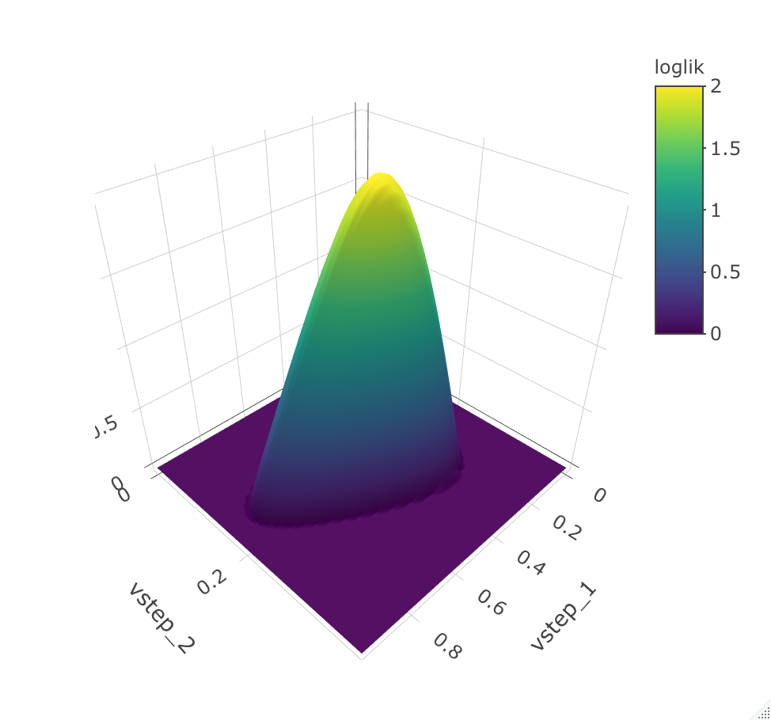
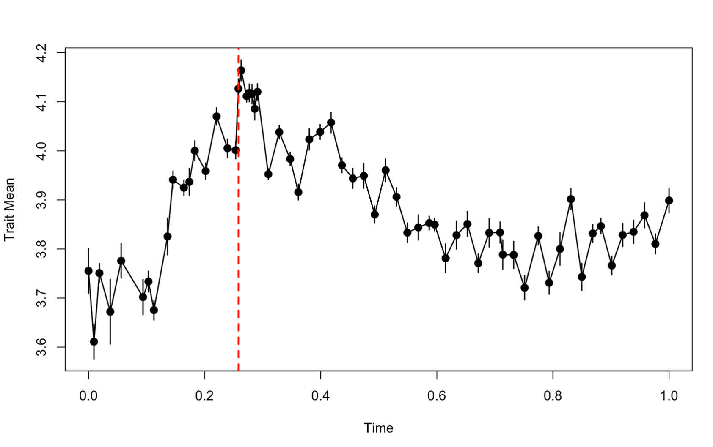

```{r, include = FALSE}
knitr::opts_chunk$set(
  collapse = TRUE,
  comment = "#>"
)
```

\newpage

# 1.0 About `evoTS`
The `evoTS` package facilitates univariate and multivariate analysis of evolutionary sequences of phenotypic change. The goal of the `evoTS` package is to offer a large range of evolutionary models to enable detailed studies of evolutionary change within lineages, in both the fossil record and in modern lineages. 

The `evoTS` package extends the modeling framework implemented in the <a href="https://cran.r-project.org/web/packages/paleoTS/index.html">`paleoTS` package</a> (Hunt 2006; 2008a; 2008b; Hunt *et al.* 2008; 2010; 2015) by containing functions to fit a large range of univariate and multivariate evolutionary models not implemented in `paleoTS`. The structure of `evoTS` have been implemented to mirror the user experience from `paleoTS` as much as possible. For example, all univariate models implemented in `evoTS` can be fitted to a `paleoTS` object, i.e. the data format used in `paleoTS`. The two packages are also completely compatible in how the fit of the models to empirical data are evaluated, which means the fit of all univariate models available in `paleoTS` and `evoTS` are directly comparable. 

`evoTS` contains a range of multivariate models, including different versions of multivariate unbiased random walks and Ornsten-Uhlenbeck processes. Together, these models allow the user to test various hypotheses of adaptation using phenotypic time-series. 

`evoTS` also contains functions for calculating likelihood surfaces of fitted models.
<br /> 
<br /> 

# 2.0 Installation

The `evoTS` package is available on GitHub and can be installed using devtools:
<br /> 
```{r eval = FALSE}
> install.packages("devtools")

> devtools::install_github("klvoje/evoTS")
```
<br /> 
The package will soon also be available on CRAN.
<br /> 
<br /> 

# 3.0 Getting data into `evoTS`
The functions in `evoTS` analyze data on the same format as `paleoTS`. An object of class paleoTS is the required input for most of the functions in `evoTS. To create a paleoTS object, you need vectors of trait/variable means, sample/population variances, sample sizes and ages of the samples/populations. 

If you already have your data uploaded in R, one easy way to create a paleoTS object is to use the `as.paleoTS` function in the `paleoTS` package. 
<br /> 
```{r eval = FALSE}
## Creating dummy data 
> trait_means<-rnorm(20)
> trait_variance<-rep(0.5,20)
> sample_size<-rep(30,20)
> time_vector<-seq(1,20,1)

# Create paleoTS object
> indata.evoTS<-paleoTS::as.paleoTS(mm = trait_means, vv = trait_variance, nn = sample_size, tt = time_vector)
````
<br /> 
Another way to get data into evoTS is to use the function read.paleoTS from the `paleoTS` package. This function imports data from a text file with four columns corresponding to trait/variable means, sample/population variances, sample sizes and ages of the samples/populations and converts the input to a paleoTS object. 

See also the `paleoTS` ([vignette](https://cran.r-project.org/web/packages/paleoTS/vignettes/paleoTS_basics.html)) for more info on how to import data and create a paleoTS object.

## 3.1 Data included in `evoTS`
Two evolutionary sequences (time-series) of phenotypic change are included in the `evoTS` package. The data are from the diatom lineage *Stephanodiscus yellowstonensis*  and were originally published in Theriot *et al.* (2006). 

We will first investigate phenotypic changes in the diameter of *S. yellowstonensis*. The data are already an object of class `paleoTS`, which is the data type analyzed in `evoTS`. The diameter has been measured in micrometres, but we are interested in investigating proportional changes in the trat. We therefore first do an approximate log-transformation of the data.We then convert the time vector in the dataset to unit length (i.e. the length in time from the oldest to youngest sample/population in the dataset is 1). Such a linear transformation of the time vector does not change how the estimated parameters describe the evolutionary dynamics in the data, but ease parameter estimation. We also plot the data to have a look at the patterns of phenotypic change.
<br /> 
```{r eval = FALSE}
## Doing an approximate log-transformation of the data
>ln.diameter<-paleoTS::ln.paleoTS(diameter_S.yellowstonensis)

## Convert the time vector to unit length
>ln.diameter$tt<-ln.diameter$tt/(max(ln.diameter$tt))

## Plotting the data
>plot(ln.diameter.paleoTS)
````
<br /> 
```{r  out.width = "60%", echo = FALSE, fig.align="center"}
knitr::include_graphics("diameter.png") 
```
<br /> 

# 4.0 Univariate models in `evoTS`
The `paleoTS` package contains functions to fit biased (GRW) and unbiased random walks (URW), stasis (modeled as a white noise process, i.e. uncorrelated variation around a constant mean), strict stasis (no real evolutionary change) and an Ornstein-Uhlenbeck (OU) processes assuming a fixed optimum. The paleoTS package also contains models of a punctuated mode of evolution where stasis is the mode of evolution inbetween one or two jump in phenotype space (i.e. punctuation). It is also possible to fit certain models where the mode of evolution shifts at some point during the evolutionary sequence.

Several new univariate models have been implemented in the `evoTS` package. Functions are also available to fit mode shifts between all univariate models available in `evoTS` and `paleoTS` combined. There are also functions available in `evoTS` that allow for more than one mode shift during the analyzed evolutionary sequence. 

The following univariate models have been implemented in the `evoTS` package:

1.	Decerelated-evolution model (an unbiased random walk with an exponential decrease in the rate of change over time)

1.	Accelerated-evolution model (an unbiased random walk with an exponential increase in the rate of change over time)

1.	The Bokma model (a punctuated equilibrium model where two (or three) unbiased random walks are separated by one (or two) jump(s) in morphospace)

1.	Ornstein-Uhlenbeck process where the optimum changes according to an unbiased random walk. 

## 4.1 Decelerated-evolution model
The decelerated model of phyletic evolution is a unbiased random walk where the step variance (i.e. the variance of the normal distribution from which evolutionary steps are drawn) is reduced exponentially through time (Voje 2020). This model is closely related to the early burst model developed for phylogenetic comparative data (Blomberg *et al.* 2003; Harmon *et al.* 2010, Cooper and Purvis 2010). 

The decerelated model of evolution can be fitted to data usign the `opt.joint.decel` function.
<br /> 
```{r eval = FALSE}
> opt.joint.decel(ln.diameter)
$logL
[1] 76.77642

$AICc
[1] -147.1461

$parameters
       anc      vstep          r 
 3.8868739  0.2892461 -1.8076302 

$modelName
[1] "Decel"

$method
[1] "Joint"

$K
[1] 3

$n
[1] 63

attr(,"class")
[1] "paleoTSfit"
```
<br /> 
The output returns the log-likelihood of the model parameter (logl), the AICc score (AICc), the number (K) of estimated parameters (parameters), the length of the analysed time-series (n), the model name (Decel) and the method used to parameterize the model (Joint). *anc* is the estimated ancestral trait, *vstep* is initial value for the step distribution, and *r* describes the exponential decay in the *vstep* parameter through time. The half-life is (-ln(2)/r) 0.38. The half-life parameter is interpreted based on the time-scale used when analyzing the data. Since time from start to end in the has been scaled to unit length, the estimated half-life represent the percent of the total length of the time-series it takes for the rate of evolution to half. The total length of the analyzed time-series is 13,728 years, which means it takes 5,217 years for the rate of evolution to be halved.

The evoTS package contains functions to explore the likelihood-surface of the fitted model. Investigating the likelihood surface can be helpful for several reasons. 

1. Estimating parameters in a model using maximum likelihood always run the risk of returning parameters from a local and not a global optimum. Investigating the support surface for combinations of parameters is one way to explore the topology of the likelihood-surface. 

1. Computing the likelihood surface is a great way to explore which parameter combinations that have an almost identical likelihood compared to the maximum likelihood values. Ridges in the log-likelihood surface can make it challenging to identify maximum likelihood estimates of the model parameters in certain cases. Flat ridges may cause identifiability issues and problems for the model to converge. 

1. Investigating the likelihood surface is also an approach to assess uncertainty in the estimated parameters. A large range of parameter values that have almost the same log-likelihood is an indication that we should be careful when interpreting the maximum-likelihood (best) estimates of the parameters. The functions in `evoTS` calculating log-likelihood surfaces report the upper and lower parameter estimates that are within two support units of the best estimate as a way to assess uncertainty in parameters (Edwards 1992).

Functions to create likelihood surfaces for univariate models in `evoTS` and `paleoTS` are included in `evoTS` (e.g. `confidence.stasis`, `confidence.URW`, `confidence.GRW`, `confidence.OU`). These functions need a paleoTS object and a set of candidate values for the parameters to be evaluated. One way to define the candidate values is to use the `seq` function. The vectors given to the arguments vstep.vec and r.vec defines the pairwise combinations of parameters for which the function will estimate the log-likelihood. How fine-scaled the estimated log-likelihood surface is depends on the step size between the values in the input-vectors. The step-size therefore determines how accurate the representation of the support surface is, including the returned upper and lower estimates printed in the console. Note that the computed support surface is conditional on the best estimates of the other model parameters that are not part of the support surface (e.g. the estimated ancestral trait value).
<br /> 
```{r eval = FALSE}
> confidence.decel(ln.diameter, vstep.vec = seq(0,1.2,0.01), r.vec = seq(-5,0,0.01))
      lower upper
vstep  0.17  1.00
r     -3.70 -0.28
```
<br /> 
```{r  out.width = "80%", echo = FALSE, fig.align="center"}
knitr::include_graphics("decel_logl_surface.png") 
```
<br /> 
From the likelihood surface and from the printed confidence intervals, we see that r values between -0.28 and -3.70 are within 2 log-likelihood units from the best estimate for this parameter. This suggests it is hard to exclude the possibility that the half-life of the decay in the rate of evolution is as much as 248% (34,045 years) or as low as 19% (2,608 years) of the time-interval investigated.

## 4.2 Accelerated-evolution model
The accelerated evolution model is identical to the decelerated model except that the r parameter is constrained to be 0 or larger, which means the rate of evolution is accelerating with time. 

The accelerated evolution model can be fitted using the `opt.joint.accel` function.
<br /> 
```{r eval = FALSE}
> opt.joint.accel(ln.diameter)

$logL
[1] 73.80287

$AICc
[1] -141.199

$parameters
      anc     vstep         r 
3.7078973 0.7903365 0.2630122 

$modelName
[1] "Accel"

$method
[1] "Joint"

$K
[1] 3

$n
[1] 63

attr(,"class")
[1] "paleoTSfit"
```
<br /> 
The accelerated evolution model has a lower (worse) log-likelihood and higher (worse) AICc score compared to the decelerated model of evolution. 

A support surface can be produced using the confidence.accel function.
<br /> 
```{r eval = FALSE}
> confidence.accel(ln.diameter, vstep = seq(0,5,0.01), r.vec = seq(0,1.5, 0.005))
      lower upper
vstep  0.17  1.00
r     -3.70 -0.28
```
<br /> 
```{r  out.width = "80%", echo = FALSE, fig.align="center"}
knitr::include_graphics("accel_logl_surface.png") 
```
<br /> 

## 4.3 The Bokma model
The `paleoTS` package contains models that portray a punctuated mode of evolution as a white noise process (stasis) punctuated by jumps in phenotype space (the function `opt.joint.punc`). Bokma (2002) suggested a different model as an interpretation of a punctuated mode of evolution along branches on a phylogeny (see also Ingram 2011 and Hunt 2013). According to Bokma’s (2002) model, a trait is evolving as a unbiased random walk in between punctuations. This model is implemented in the `evoTS` package and can be ran using the function `fit.PE.Bokma` The rate parameter (*vstep*) in the unbiased random walks before and adter a punctation event is free to differ. The function investigates and compares all possible locations for the punctuation and returns the shift point and the parameter values with the highest log-likelihood for each of the two unbiased random walks. The length of the shortest sequence (i.e. the number of samples/populations) that is used to parameterize each random walk is defined by the argument `minb.` The user can also define which sample/population in the time series that represents the punctuation event using the argument `shift.point` (e.g. shift.point=20). Fitting Bokma's model with two punctuations and parameterizing three unbiased random walks can be done by using the function `fit.2.PE.Bokma`.
<br /> 
```{r eval = FALSE}
> fit.Bokma(ln.diameter, minb=10)

[1] "Searching for all possible switchpoints in timeseries"
Total # hypotheses:  44 
1  2  3  4  5  6  7  8  9  10  11  12  13  14  15  16  17  18  19  20  21  22  23  24  25  26  27  28  29  30  31  32  33  34  35  36  37  38  39  40  41  42  43  44  
$logL
[1] 83.38311

$AICc
[1] -155.7136

$parameters
       anc    vstep_1    new.opt    vstep_2     shift1 
 3.7157502  0.3419322  4.1349082  0.1668632 18.0000000 

$modelName
[1] "PE.Bokma"

$method
[1] "Joint"

$K
[1] 5

$n
[1] 63

$all.logl
 [1] 80.31088 79.51765 80.01722 79.66074 80.48083 79.89100 79.42840 83.38311 80.77101 80.77826 79.85728 79.68613 79.59643
[14] 79.44200 82.63356 81.44387 81.21899 81.02157 82.02478 80.99060 80.56377 81.29680 80.52947 80.10540 80.41855 80.58089
[27] 80.27750 80.49915 79.77512 79.54571 79.07448 79.59706 79.30831 79.04140 79.46599 79.23228 78.96974 78.89496 78.87805
[40] 79.21300 79.62620 79.49839 79.30760 79.69878

$GG
     [,1] [,2] [,3] [,4] [,5] [,6] [,7] [,8] [,9] [,10] [,11] [,12] [,13] [,14] [,15] [,16] [,17] [,18] [,19] [,20]
[1,]   11   12   13   14   15   16   17   18   19    20    21    22    23    24    25    26    27    28    29    30
     [,21] [,22] [,23] [,24] [,25] [,26] [,27] [,28] [,29] [,30] [,31] [,32] [,33] [,34] [,35] [,36] [,37] [,38] [,39]
[1,]    31    32    33    34    35    36    37    38    39    40    41    42    43    44    45    46    47    48    49
     [,40] [,41] [,42] [,43] [,44]
[1,]    50    51    52    53    54

attr(,"class")
[1] "paleoTSfit"
```
<br /> 
The model with the highest likelihood has a punctuation event at sample (population) 18. The rate of evolution before the punctuation (*v_step.1*) is about twice the magnitude of the rate of evolution after the punctuation (*v_step.2*). 

Note: `all.logl` lists the log-likelihoods for each of the investigated shift points. All investigated shift points are given by `GG`. 

The log-likelihood surface can be investigated using the `confidence.PE.Bokma` function. Notice that we need to condition the estimated log-likelihoods for the pairwise parameter combinations of *vstep_1* and *vstep_2* on the most likely parameter estimates of the punctuation (*shift1*), ancestral trait value (*anc*) and the new optimum after the punctuation (*new.opt*). 
<br /> 
```{r eval = FALSE}
> confidence.PE.Bokma (ln.diameter.paleoTS, vstep_1.vec=seq(0,1,0.01), vstep_2.vec=seq(0,0.4, 0.01),shift=18, anc=3.7157502  , new.opt=4.1349082)

        lower upper
vstep_1  0.14  0.91
vstep_2  0.10  0.30
```
<br /> 
```{r  out.width = "60%", echo = FALSE, fig.align="center"}
 
```
<br /> 
We can compare the fit of the Bokma model to the alternative interpretation of a punctuated mode of evolution where the trait evolves according to a model of stasis in between the punctuation events. This model is implemented in `paleoTS` and can be fitted using the `fitGpunc` function:
<br /> 
```{r eval = FALSE}
> Bokma.PE<-fit.PE.Bokma(ln.diameter, minb=10, silent=TRUE)
[1] "Searching for all possible switchpoints in timeseries"

> Stasis.PE<-paleoTS::fitGpunc(ln.diameter, minb=10, silent = TRUE)

> Bokma.PE$AICc;Stasis.PE$AICc
[1] -155.7136
[1] -87.63458
```
<br /> 
The model where the trait evolves as a unbiased random walk between the punctuation event (i.e. the Bokma model) has the best relative fit in this case. 
<br /> 

## 4.4 Ornstein-Uhlenbeck model with moving optimum.
The `paleoTS` package includes an Ornstein-Uhlenbeck (OU) model of evolution with a single and fixed optimum (Hunt *et al.* 2008). This model portrays evolutionary adaptation of a trait towards a fixed peak on the adaptive landscape. The `evoTS` package contains an OU model where the optimum (peak) is not fixed but is constantly changing according to an unbiased random walk. Such a model was proposed by Hansen *et al.* (2008) for analyses of phylogenetic comparative data. Adjusted to describe evolution of a single lineage, the expected trait mean and its variance and covariance are given by the following expressions:
<br /> 
<br /> 
$$E[z_{i}] = e^{(-\alpha t_{i})}z_{0} + [1-e^{-\alpha t_{i}}]\theta$$
<br /> 
$$Var[z_{i}] =\left[ \frac{ \sigma^{2}_{step}+\sigma^{2}_{\theta}}{2\alpha} \right] \left[ 1-e^{(-2\alpha t_{i})}\right] + \sigma^{2}_{\theta}t_{i} \left[  1-2(1-e^{-\alpha t_{i}}) \right]/\alpha t_{i} + \epsilon _{i} $$
<br /> 
$$Cov[z_{i},z_{j}] =\left[ \frac{ \sigma^{2}_{step}+\sigma^{2}_{\theta}}{2\alpha} \right] \left[ 1-e^{(-2\alpha t_{a})}\right]e^{-\alpha t_{ij}} + \sigma^{2}_{\theta}t_{a} \left[  1-\left[1+e^{-\alpha t_{ij}} \right] \left( 1-e^{-\alpha t_{a}} \right) \right] /  \alpha t_{i} + \epsilon _{i} $$
<br /> 
The model can be fitted using the `opt.joint.OUBM` function.
<br /> 
```{r eval = FALSE}
> opt.joint.OUBM(ln.diameter)
[1] "Running no iterations."
$logL
[1] 78.5667

$AICc
[1] -148.4437

$parameters
anc/theta.0 vstep.trait       alpha   vstep.opt 
 3.71050957  0.25577376  4.45009847  0.00000001 

$modelName
[1] "OU w. moving optimum (anc at opt)"

$method
[1] "Joint"

$K
[1] 4

$n
[1] 63

$iter
[1] NA

attr(,"class")
[1] "paleoTSfit"
```
<br /> 
The *vstep.opt* parameter represent the rate of change in the optimum. This is extremely small (virtually zero), which means the optimum is essentially fixed. The alpha in the OU model represents the strength of the pull towards the optimum. A parameter that is easier to interpret compared to the alpha is the half-life (log(2)/*alpha*), which is the time it takes for the trait to move half-way to the optimum from the ancestral state. The half life is therefore a quantification of the speed of adaptation towards the optimal state. As for the decelerated and accelerated models of evolution, the interpretation of the half life depends on the time-interval covered by the time-series. Since the time-interval of the time-series is scaled to unit length (i.e. the time from the start to the end of the time-series is 1), this means the half-life can be interpreted as the percent of the total length of the time-series. The half-life in our example is (log(2)/*alpha* =) 0.16. According to this point estimate, it takes the trait 16% of the total length of the time-series to evolve half-way towards the optimum, which is about (13,728 years * 0.16 =) 2197 years.

Notice that the name of the first reported parameter is *anc*/*theta.0*. This parameter represents the ancestral trait value, but also the value of the "ancestral" optimum. The default option in the `opt.joint.OUBM` function is to assume that the trait was perfectly adapted at the start of the time-series (the argument `anc.opt = TRUE`), but this can be changed by setting `anc.opt = FALSE`
<br /> 
```{r eval = FALSE}
> opt.joint.OUBM(ln.diameter, opt.anc  = FALSE)
[1] "Running no iterations."
$logL
[1] 80.71298

$AICc
[1] -150.3733

$parameters
        anc vstep.trait     theta.0       alpha   vstep.opt 
 3.70318166  0.27295537  3.89044816 11.89404598  0.00000001 

$modelName
[1] "OU w. moving optimum"

$method
[1] "Joint"

$K
[1] 5

$n
[1] 63

$iter
[1] NA

attr(,"class")
[1] "paleoTSfit"
```
<br /> 
Notice that a separate “ancestral” value for the optimum (*theta.0*) is estimated which is different from the ancestral trait value. The rate of change in the optimum is still negligible, which means this model is virtually identical to a model where the optimum is fixed. This can be shown by fitting an OU model where the optimum is fixed, a model included in the `paleoTS` package.
<br /> 
```{r eval = FALSE}
> paleoTS::opt.joint.OU(ln.diameter)
$logL
[1] 80.71298

$AICc
[1] -152.7363

$parameters
       anc      vstep      theta      alpha 
 3.7031755  0.2729606  3.8904481 11.8940464 

$modelName
[1] "OU"

$method
[1] "Joint"

$K
[1] 4

$n
[1] 63

attr(,"class")
[1] "paleoTSfit"
```
<br /> 
The fixed optimum model gives the same log-likelihood value as model where the optimum was allowed to change (but actually didn’t). The fixed optimum model has a better AICc score as this model contains one less parameter (the parameter describing the rate of change in the optimum).

It is good practice to repeat any numerical optimization procedure from different starting points. This is especially important when the model has several parameters, as parameter-rich models may contain more than one peak in the log-likelihood surface. The OUBM model is a type of model that may have several local peaks in the likelihood space. The user can choose the number of iterations of the numerical optimization of the OUBM model using the argument iterations. The function will return the parameter values from the run with the highest likelihood, along with the number of optima found and their distance in units of log-likelihood to the highest detected peak. The starting values in each iteration are drawn from a normal distribution with mean zero and a standard deviation set by the user (default is 1). The initial values for the vstep, alpha and the omega parameters are constrained to be equal or largen than 0. 

Here, we run the opt.joint.OUBM function (assuming the trait value is perfectly adapted at the start of the sequence) from 1,000 different starting points:
<br /> 
```{r eval = FALSE}
> opt.joint.OUBM(ln.diameter, opt.anc = TRUE, iterations = 100)
$logL
[1] 78.5667

$AICc
[1] -148.4437

$parameters
anc/theta.0 vstep.trait       alpha   vstep.opt 
 3.71050959  0.25577389  4.45010533  0.00000001 

$modelName
[1] "OU w. moving optimum (anc at opt)"

$method
[1] "Joint"

$K
[1] 4

$n
[1] 63

$iter
[1] 100

attr(,"class")
[1] "paleoTSfit"
```
<br /> 
From the output, we see that the likelihood score of the best model among the 100 model runs is identical to the score when running the model without iterations of the starting values of the parameters. However, the maximum likelihood parameter estimates are slightly different (e.g. a differce in the sixth decimal for the *vstep* parameter), but not to an extent that changes our interpretation of the trait dynamics. This suggests that the detected peak in the log-likelihood landscape is not completely smooth, and that there exists minuscule spikes very close to each other at the peak.

The `evoTS` package contains functions to estimate likelihood surfaces for the different versions of the OU models (`confidence.OU` and `confidence.OU.BM`). In these functions, the likelihood surface is not estimated as a function of the step variance and alpha parameter directly, but rather as a function of two related parameters that are easier to give a biological interpretation. The stationary variance (*vstep*/2**alpha*) represents the equilibrium variance of the OU process (Hansen et al. 2008) and describes the variance expected in the trait after the trait has reached the optimum. The half-life (log(2)/*alpha*) is the amount of time it takes for the trait to move half-way from the ancestral state to the optimum. The half-life is informative regarding the speed of adaptation toward the optimal state. 

The OU model with a fixed optimum had the best relative model fit according to AICc among the three versions of the OU model we investigated. The half-life from this OU-model is (log(2)/ 11.8941) = 0.0583. Since we scaled the time-interval of the time-series to unit length (i.e. the time from the start to the end of the time-series is 1), this means it takes about 6% of the length of our data to get half-way to the optimal value.  The total length of our time-series in years is 13,728, which means it takes (13728 * 0.0583 = ) 800 years to get half-way to the optimum. But this is only a point-estimate. We can explore the support interval around this point estimate of the half-life (and the stationary variance) using the `confidence.OU` function.
<br /> 
```{r eval = FALSE}
> confidence.OU(ln.diameter, stat.var.vec=seq(0,0.1,0.001), h.vec=seq(0,0.4,0.001))
      lower upper
stationary variance 0.007 0.053
half-life           0.029 0.305
```
<br /> 
```{r  out.width = "60%", echo = FALSE, fig.align="center"}
knitr::include_graphics("OU_logl_surface.png") 
```
<br /> 

## 4.5	 Fitting all univariate models in `evoTS` and `paleoTS`
A quick way to evaluate the relative fit of all univariate models in the `evoTS` and `paleoTS`packages (excluding models with more than one puntuation) is to use the `fit.all.univariate.models` function. 
<br /> 
```{r eval = FALSE}
> fit.all.univariate.models(ln.diameter)
## Omitting some of the output to save length. 

Comparing 11 models [n = 63, method = Joint]

                                        logL K       AICc Akaike.wt
GRW                                 77.64073 3 -148.87469     0.022
URW                                 77.57018 2 -150.94035     0.063
Stasis                              39.84019 2  -75.48039     0.000
StrictStasis                      -707.46411 1 1416.99379     0.000
Decel                               76.77642 3 -147.14607     0.009
Accel                               73.80287 3 -141.19896     0.000
OU                                  80.71298 4 -152.73631     0.155
OU w. moving optimum (anc at opt)   78.56670 4 -148.44374     0.018
OU w. moving optimum                80.71298 5 -150.37333     0.047
Punc-1                              50.03827 4  -91.38688     0.000
PE.Bokma                            83.38311 5 -155.71359     0.685
```
<br /> 
The Bokma model where the trait evolves as a random walk before and after the punctuation outcompetes the OU model according to AICc. 

Where the jump happens can be investigated by plotting the data and putting a line at the estimated switch point.
<br /> 
<br /> 
```{r  out.width = "60%", echo = FALSE, fig.align="center"}
 
```
<br /> 
<br /> 
The switch point is estimated to ihappen where there is no obvious and large jump in the evolution of the trait along the y axis. The reason why this model fits better than the other candidate models might therefore be unrelated to the jump itself and may instead be due to the fact that the rate of evolution is allowed to be different before and after the punctuation. The rate parameter (*vstep_1*) of the unbiased random walk before the punctuation is indeed about twice as large as the rate parameter (*vstep_2*) in the unbiased random walk after the puntuation. 
<br /> 
```{r eval = FALSE}
> Bokma.PE$parameters
       anc    vstep_1    new.opt    vstep_2     shift1 
 3.7157502  0.3419322  4.1349082  0.1668632 18.0000000 
```
<br /> 
We should therefore investigate whether a model that fits two separate unbiased random walks to two non-overlapping segments of the time-series is able to outcompete the Bokma model.

## 4.6	 Fitting combinations of univariate models to a timeseries (mode shift)
There is no a priori reason why a lineage should follow a single mode of evolution. The `evoTS` package allows for investigating all pairwise model combinations of the models Stasis, Unbiased random walk (WRW), Trend (GRW) and Ornstein-Uhlenbek (OU) using the function `fit.two.univariate.models`.

We are interested in investigating whether a model consisting of two different random walks fits the data better compared to a punctuated evolution model (The Bokma model). We can constrain the function to only investigate the same shift point as the one found to be the best for the Bokma model using the argument `shift.point`. However, we are interested in investigating all possible switch points.
<br /> 
```{r eval = FALSE}
> fit.two.univariate.models(ln.diameter, model1 = "URW", model2 = "URW", minb = 10)
[1] "Searching all possible switchpoints in the evolutionary sequence"
Total # hypotheses:  44 
1  2  3  4  5  6  7  8  9  10  11  12  13  14  15  16  17  18  19  20  21  22  23  24  25  26  27  28  29  30  31  32  33  34  35  36  37  38  39  40  41  42  43  44  
$logL
[1] 79.27473

$AICc
[1] -149.8598

$parameters
       anc      vstep      vstep     shift1 
 3.7304865  0.2432594  0.2494817 52.0000000 

$modelName
[1] "URW-URW"

$method
[1] "Joint"

$K
[1] 4

$n
[1] 63

$all.logl
 [1] 70.86731 68.59747 62.65156 65.41455 53.23718 60.25449 56.19608 45.50594 42.55632 44.70092 46.05836 46.58797
[13] 48.14004 44.19647 67.63474 57.82010 64.69928 69.73926 58.45089 55.26295 53.40897 64.95625 66.97684 66.65108
[25] 72.98220 65.42928 71.12637 76.39216 74.96141 74.07654 74.06923 77.98640 75.27489 73.96364 78.18181 74.92223
[37] 75.10229 77.07127 77.28518 79.12256 75.99980 79.27473 76.45725 70.37393

$GG
shift1 
    52 

attr(,"class")
[1] "paleoTSfit"
```
<br /> 
The fit of this model is similar (but worse) according to AICc compared to the Bokma model model. 

It is also possible to use the function `fit.two.univariate.models` to fit all pairwise combinations of the four models by setting the `fit.all` argument as TRUE. If a shift point is not defined (using the `shift.point` argument), all possible shift points are investigated for all models. 
<br /> 
```{r eval = FALSE}
> fit.two.univariate.models(ln.diameter, fit.all = TRUE, minb = 10, )
[1] "Searching all possible switchpoints in the evolutionary sequence"
1  2  3  4  5  6  7  8  9  10  11  12  13  14  15  16  17  18  19  20  21  22  23  24  25  26  27  28  29  30  31  32  33  34  35  36  37  38  39  40  41  42  43  44  
Comparing 16 models [n = 63, method = Joint]

                  logL K       AICc Akaike.wt
Stasis-Stasis 53.41478 4  -98.13991     0.000
Stasis-URW    72.84306 4 -136.99646     0.000
Stasis-GRW    72.84414 5 -134.63564     0.000
Stasis-OU     74.97027 6 -136.44053     0.000
URW-URW       79.27473 4 -149.85981     0.001
URW-GRW       79.54430 5 -148.03597     0.000
URW-OU        85.32562 6 -157.15123     0.036
GRW-GRW       84.03615 6 -154.57229     0.010
GRW-OU        88.86992 7 -161.70347     0.350
OU-OU         88.34795 8 -158.02923     0.056
OU-GRW        84.14765 7 -152.25894     0.003
OU-URW        83.90670 6 -154.31340     0.009
OU-Stasis     87.66071 6 -161.82143     0.372
GRW-URW       83.79338 5 -156.53412     0.026
GRW-Stasis    86.53257 6 -159.56513     0.120
URW-Stasis    83.34316 5 -155.63369     0.017
[[1]]
$logL
[1] 87.66071

$AICc
[1] -161.8214

$parameters
         anc        vstep     theta_OU        alpha        omega       shift1 
 3.695580875  0.323335244  3.814178130  5.226496747  0.001760509 38.000000000 

$modelName
[1] "OU-Stasis"

$method
[1] "Joint"

$K
[1] 6

$n
[1] 63

$GG
shift1 
    38 

attr(,"class")
[1] "paleoTSfit"
```
<br /> 
The function returns a list of the highest log-likelihood found for each model. A detailed output from the model with the lowest AICc value among the 16 candidate models is also given. An OU-Stasis model with a shift point at sample (population) 38 has the best relative fit according to AICc. Note, however, that the model-combination Trend-OU (GRW-OU) has an almost equal AICc score relative to the best model. These two models show an almost identical relative fit to the data. Also, the combination of OU models (each with their own fixed optimum) shows a good relative fit to the data. All these three models have a better AICc score compared to the Bokma model. 
<br /> 
<br /> 
<br />

# 5.0 Multivariate models
Traits are rarely changing independently of each other due to shared genetics or development. Evolution is accordingly a multivariate phenomenon. The `evoTS` package includes functions to fit the following multivariate trait models:

*	Multivariate unbiased random walks

*	Multivariate decelerated evolution

*	Multivariate accelerated evolution

* Multivariate Ornstein-Uhlenbeck processes 

## 5.1 Multivariate unbiased random walks with and without changes in the rate of evolution
Evolution as a multivariate unbiased random walk is modeled using an evolutionary rate matrix **R**. The diagonal elements in **R** represent the rate of evolution for the individual traits, while the off-diagonal elements represent the extent to which different traits co-evolve. The multivariate variance-covariance matrix for the Unbiased random walk model (**V**) is computed using the Kronecker product of the **R** matrix and a “distance matrix” **C**, describing the distance in time between the different samples/populations in the time-series. Sampling error of the trait mean (calculated as the sample variance divided by the sample size) is – as for all models in `evoTS` – added to the diagonal of the **V** matrix. To ensure symmetric positive definiteness of the **V** matrix during log-likelihood optimization, **R** is parameterized by its Cholesky decomposition as the cross-product of upper triangular matrices. In cases where different parts of the evolutionary time-series are described by $R_{m}$ matrices, **V** is computed as the sum of the different $R_{m}$ and $C_{m}$ matrices:
<br /> 
<br /> 
$$V = \sum_{i=1}^{m} R_{m} \otimes C_{m}$$
<br /> 
The current implementation of the multivariate unbiased random walk model allows testing six variants of the model. The six variants of the model can be fitted using different specifications of `R` and `r` in the `fit.multivariate.URW` function. 

The `R` option defines which elements in the **R** matrix that will be estimated. There are two options for the structure of the **R** matrix. Setting `R = "diagonal"` means only the diagonal elements of the **R** matrix will be estimated while off-diagonal elements are set to  (see panel a below) This parameterization of the **R** matrix means the stochastic changes in the traits are assumed to be uncorrelated. Setting `R = "symmetric"` means all (both diagonal and off-diagonal) elements in the R matrix are estimated (panel b below). This parameterization  means the stochastic changes in the traits are assumed to be correlated, i.e. that evolutonary changes are non-independent.
<br /> 
<br /> 
```{r  out.width = "40%", echo = FALSE, fig.align="center"}
knitr::include_graphics("R_matrices.png") 
```
<br />
<br /> 
The argument `r` in the `fit.multivariate.URW` function defines whether the rate of change is assumed constant ("fixed"), asymptotically decreasing ("decel"), or asymptotically increasing ("accel") with time. Defining `r` as "fixed" means a regular multivariate unbiased random walk will be fitted to the data. The "decel" and "accel" options fits multivariate versions of the decelerated and accelerated versions of the unbiased random walk, respectively. These latter two models deviate from the multivariate unbiaseed random walk in that the distance matrix **C** is transformed by an exponential decay or acceleration parameter, *r*, that is jointly estimated during the maximum likelihood search for the **R** matrix. A common *r* parameter is assumed for all the traits.

To use the multivariate models, we first need multivariate data (e.g. at least two traits or variables). 

The dataset on phenotypic evolution in *Stephanodiscus yellowstonensis* (Theirot et al. 2006) contains data on the number of ribs in addition to the size measure we have analyzed so far. To make the rib data set ready for multivariate analyses together with the size (diameter) data set, we first do an approximate log-transformation of the riv data and convert the time vector to unit length.
<br /> 
```{r eval = FALSE}
## Doing an approximate log-transformation of the data
> ln.ribs<-paleoTS::ln.paleoTS(ribs_S.yellowstonensis)

## Convert the time vector to unit length
> ln.ribs$tt<-ln.ribs$tt/(max(ln.ribs$tt))
````
<br /> 
To make a multivariate data set ready to be analyzed in evoTS, we combine the two paleoTS objects into a multivariate evoTS object using the make.multivar.evoTS function.
<br /> 
```{r eval = FALSE}
> diam.ln_ribs.ln<-make.multivar.evoTS(ln.diameter, ln.ribs)
````
<br /> 
We can use the plotevoTS.multivariate function to have a look at the combined data set.
<br /> 
```{r eval = FALSE}
> plotevoTS.multivariate(diam.ln_ribs.ln, y_min=3.4, y_max=4.8, x.label = "Relative time", pch=c(20,20)
````
<br /> 
```{r  out.width = "60%", echo = FALSE, fig.align="center"}
knitr::include_graphics("diam_and_ribs.png") 
```
<br /> 
<br /> 
Eye-balling the data seems to suggest that the traits change in a coordinated fashion.

We first fit a multivariate unbiased random walk model where the off-diagonal elements in the **R** matrix are zero, and the rate of evolution is assumes constant. This is equivalent as fitting to separate univariate unbiased random walks models to each of the two time-series. 
<br /> 
```{r eval = FALSE}
> fit.multivariate.URW(diam.ln_ribs.ln, R = "diag", r = "fixed")
[1] "Model converged successfully."
$modelName
[1] "Multivariate Random walk (R matrix with zero off-diagonal elements)"

$logL
[1] 135.8697

$AICc
[1] -263.0498

$ancestral.values
[1] 3.715649 4.013975

$R
          [,1]      [,2]
[1,] 0.2555386 0.0000000
[2,] 0.0000000 0.4695467

$SE.R
[1] NA

$method
[1] "Joint"

$K
[1] 4

$n
[1] 63

$iter
[1] NA

attr(,"class")
[1] "paleoTSfit"
````
<br /> 
The returned parameters include the ancestral trait values for the two traits and the evolutionary rate matrix **R**. The diagonal in the **R** matrix contains the step size (rate of evolution) parameters. The first trait (diameter) has about twice the rate of evolution as the second parameter (ribs). The off-diagonal elements are zero as this model is not estimating the covariation of the evolutionary changes. 

Next, we fit a model that allows the off-diagonal elements in the R matrix to be different from zero. We do this by setting `R = symmetric`. We are still keeping the rate of change fixed.
<br /> 
```{r eval = FALSE}
> fit.multivariate.URW(diam.ln_ribs.ln, R = "symmetric", r = "fixed")
[1] "Model converged successfully."
$modelName
[1] "Multivariate Random walk (R matrix with non-zero off-diagonal elements)"

$logL
[1] 181.8526

$AICc
[1] -352.6525

$ancestral.values
[1] 3.719176 4.029796

$R
          [,1]      [,2]
[1,] 0.2787967 0.3878622
[2,] 0.3878622 0.5635895

$SE.R
[1] NA

$method
[1] "Joint"

$K
[1] 5

$n
[1] 63

$iter
[1] NA

attr(,"class")
[1] "paleoTSfit"
````
<br /> 
A multivariate random walk has a much better fit compared to treating the traits univariately according to AICc. This indicates that the traits are not evolving independently of each other. The estimated *R* matrix indicates that the first trait has about half the rate of evolution as the second trait and that there is substantial covariance in the evolutionary changes of the two traits. The evolutionary correlation can be computed by standardizing the covariance with the product of the standard deviations on the diagonal (This can also be using the function cov3cor in the `stats` package).
<br /> 
```{r eval = FALSE}
> 0.3878622/(sqrt(0.2787967)*sqrt(0.5635895))
[1] 0.9784805

# Or alternatively:
> model1<-fit.multivariate.URW(diam.ln_ribs.ln, R = "symmetric", r = "fixed")
[1] "Model converged successfully."
> stats::cov2cor(model1$R)
          [,1]      [,2]
[1,] 1.0000000 0.9784806
[2,] 0.9784806 1.0000000
````
<br /> 
A correlation of 0.98 basically means the two traits can be considered to evolve as a single trait. Given that at least part of the deviation from a correlation of unity is due to measurement error, this is a very strong indication that the traits are evolving as one trait 

Note that the **R** matrix is not describing the underlying genetic or phenotypic (co)variances of the traits. The **R** matrix is therefore not the same as a **P** (or **G**) matrix. However, the **R** matrix is tightly connected to these matrices within evolutionary quantitative genetics. For example, if the traits evolve only due to drift, the **R** matrix is expected to be proportional to the additive genetic variance–covariance matrix (**G**) matrix (Lande 1979; Felsenstein 1988). Estimating **R** can therefore aid in evolutionary interpretations of the fossil record anchored in evolutionary quantitative genetics.

Standard errors of the elements in the R matrix can be approximated by the square roots of the diagonal elements of the inverse of the negative of the Hessian matrix. These standard errors are automatically estimated and reported if the argument `hess=TRUE` in defined. 

Parameterizing multivariate models is demanding in relation to computational time (Felsenstein 1973; Hadfield and Nakagawa 2010; Freckleton 2012). Be aware that fitting the multivariate models to several traits with many samples (populations) will take much longer time than fitting univariate models to each trait separately. One way to somewhat follow the progress of the model fit is to set `trace = TRUE`. This allows the user to follow the progress of the optimization routine to minimize the likelihood function. 

The likelihood surface of multivariate models can contain several local peaks. It is therefore recommended to rerun the model fit from different starting points (i.e., different initial values). The number of iterations can be defined by the iterations argument (e.g., `iterations = 10`). Initial values for the search algorithm are drawn from a normal distribution with a default standard deviation of 1. The user can set this standard deviation by the iter.sd argument. (e.g., `iter.sd = 0.5`).

We can check if we find evidence for a change in the **R** matrix along the time-series. This involves estimating a separate **R** matrix for two non-overlapping parts of the time-series. This is done using the function `fit.multivariate.URW.shift`. We can define the shift point using the argument `shift.point` (e.g., `shift.point = 20`) or we can investigate all possible shift points in the time series by not defining a shift point (the default option). The length of the smallest number of samples (populations) in each of the two segments is controlled by the `minb` argument (the default is 10). 
<br /> 
```{r eval = FALSE}
> fit.multivariate.URW.shift(diam.ln_ribs.ln, hess = TRUE)
[1] "Searching for all possible switchpoints in timeseries"
Total # hypotheses:  44 
1  [1] "Model converged successfully."
2  [1] "Model converged successfully."
# Omitted some of the printed output 
44  [1] "Model converged successfully."

$modelName
[1] "Multivariate Random walk with two R matrices (with non-zero off-diagonal elements)"

$logL
[1] 189.7424

$AICc
[1] -358.0887

$ancestral.values
[1] 3.728940 4.055547

$R
$R$R.1
          [,1]      [,2]
[1,] 0.3633035 0.6331324
[2,] 0.6331324 1.1402896

$R$R.2
          [,1]      [,2]
[1,] 0.2220926 0.2712090
[2,] 0.2712090 0.3376271


$SE.R
$SE.R$SE.R.1
           [,1]       [,2]
[1,] 0.01701042 0.02975274
[2,] 0.02975274 0.06850436

$SE.R$SE.R.2
            [,1]        [,2]
[1,] 0.003426091 0.004333208
[2,] 0.004333208 0.006481010


$method
[1] "Joint"

$K
[1] 9

$n
[1] 63

$iter
[1] NA

$parameters
shift1 
    18 

$all.logl
 [1] 186.3352 184.1136 185.2123 188.5563 188.9149 186.5875 186.0033 189.7424 186.3212 186.2200 185.5447
[12] 184.9384 184.4486 184.0647 187.5535 185.1279 186.3236 186.3285 187.3570 185.9061 185.2030 186.0518
[23] 186.3088 184.8322 184.9602 184.2766 185.0280 185.3865 184.2946 183.7373 182.9746 182.5979 181.3128
[34] 180.8803 181.0370 180.4002 179.8530 179.5366 179.5296 179.5023 179.6067 179.4793 179.3429 179.4833

$GG
     [,1] [,2] [,3] [,4] [,5] [,6] [,7] [,8] [,9] [,10] [,11] [,12] [,13] [,14] [,15] [,16] [,17] [,18]
[1,]   11   12   13   14   15   16   17   18   19    20    21    22    23    24    25    26    27    28
     [,19] [,20] [,21] [,22] [,23] [,24] [,25] [,26] [,27] [,28] [,29] [,30] [,31] [,32] [,33] [,34]
[1,]    29    30    31    32    33    34    35    36    37    38    39    40    41    42    43    44
     [,35] [,36] [,37] [,38] [,39] [,40] [,41] [,42] [,43] [,44]
[1,]    45    46    47    48    49    50    51    52    53    54

attr(,"class")
[1] "paleoTSfit"
````
<br /> 
Two **R** matrices are returned (R.1 and R.2), along with their standard errors (since we used `hess = TRUE`). The estimated shift point is 18 (*shift1*), which is the same shift point we detected when fitting the Bokma model to the diameter time series. The rate of evolution is much larger in the second trait compared to the first trait (the diagonal elements in R.1) while the difference in rate of evolution is much smaller after the shift point (the diagonal elements in R.2). The evolutionary correlation is 0.98 and 0.99 before and after the shift point. The number of parameters (*K*) for this model is 9 compared to 5 for the model where we estimated a single *R* matrix for the multivariate data set. The model with two *R* matrices has a lower (better) AICc score compared to the model with a single R matrix. This difference in AICc scores is likely to be a result of the differences in rates of evolution in R.1 and R.2 since the evolutionary correlation is estimated to be very similar in both R.1 and R.2. 

We  now check if the multivariate accelerated and decelerated models have a better fit than the multivariate random walk models.
<br /> 
```{r eval = FALSE}
> multi.accel<-fit.multivariate.URW(diam.ln_ribs.ln, R = "symmetric", r = "accel")
[1] "Model converged successfully."
> multi.decel<-fit.multivariate.URW(diam.ln_ribs.ln, R = "symmetric", r = "decel")
[1] "Model converged successfully."
> multi.accel$AICc;multi.decel$AICc
[1] -336.454
[1] -351.5167
````
<br /> 
The multivariate decelerated evolution model has a similar (but slightly worse) fit to the data compared to the multivariate unbiased random walk model with a single **R** matrix, but is outcompeted by the model with two **R** matrices. 

## 5.2 Multivariate Ornstein-Uhlenbeck models
The multivariate Ornstein-Uhlenbeck process is described by the following differential equation:
<br /> 
<br /> 
$$dY = A(\theta(t)-Y(t))dt + RdW(t)$$
<br /> 
where *A* is square matrix with dimensions equal to the number of investigated traits that describes the rate of evolution toward the optimal trait values (**A** is often called the pull matrix), $\theta$ is a vector containing the optimum for each trait, **R** is a square matrix with dimensions equal to the number of investigated traits describing the stochastic changes in the traits (**R** is often called the drift matrix) (Bartoszek *et al.* 2012; Reitan *et al.* 2012; Clavel *et al.* 2015). Under the assumption that the we only have one selective regime (optimum) per trait, the  expected trait mean of the Ornstein-Uhlenbeck process is the weighted sum of the optimum and the root value (Hansen 1997):
<br /> 
<br /> 
$$E\left[Z_{i}\right]= e^{(-At_{i})}z_{0} + (1-e^{(-At_{i})}\theta)$$
<br /> 
where $Z_{i}$ is the expected trait value for sample *i*, $z_{0}$ is the ancestral trait mean, *Θ* is the optimum, *A* is the pull matrix measures the rate of adaptation to the optimum, and $t_{i}$ is the time interval from the ancestral population mean (the start of the time-series, which has a time of 0) to the ith population mean.

The variance and covariance of sample means are given by the following expression:
<br /> 
<br /> 
$$Cov(z_{i}, z_{j})=\left[P\left( \left[ \frac{1}{\lambda_{k} + \lambda_{l}} \left( 1-e^{-({\lambda_{k} + \lambda_{l})}t_{a}}\right)\right]_{1\le kl \le m}   \odot P^{-1}\Sigma\Sigma^{T}(P^{-1})^{T}\right) P^{T}\right]e^{-A^{T}t_{ij}}$$
<br /> 
where P is the orthogonal matrix of eigenvectors of A, $\Sigma\Sigma^{T}$ is the Cholesky decomposition of the *R* matrix, $\lambda_{i}$ is the eigenvalue of the ith trait, $t_{a}$ is the time interval from the ancestral population to the oldest of the two populations $z_{i}$ and $z_{j}$, and $t_{ij}$ is the time separating two samples z_i and z_j, while $\odot$ represents the Hadamard (element-wise) product.

Different ways to parameterize the A matrix allows testing a range of evolutionary hyptheses using the multivariate OU process. While the R matrix in the multivariate version of unbiased random walk (and in the multivariate OU model) either needs to be diagonal (only elements on the diagonal while off-diagonal elements are zero) or complete (in the sense that both the diagonal and off-diagonal elements are non-zero), this is not the case for the A matrix. Generally, we can divide up the hypotheses being tested using the multivariate OU into four different types:
<br /> 

* Independent evolution (only diagonal elements in both the A and the R matrix, i.e. equivalent as fitting univariate models to each trait separately.)

* Independent adaptation (only diagonal elements in the A matrix while the R matrix is completely parameterized. In such a model, the traits are adapting independently toward their optima, but the stochastic changes in the trait are correlated.)

* At least one trait affects the optimum of the other trait. The diagonal and at least one of the off-diagonal elements in the A matrix is non-zero. It is the trait in the column of the non-zero off-diagonal element that affects the optimum of the trait in the row of the non-zero off-diagonal element. The the stochastic changes in the trait can be either correlated or non-correlated.

* At least two traits affect each others optimum. Symmetric off-diagonal elements are present in the A matrix. The the stochastic changes in the trait can be either correlated or non-correlated.
<br /> 
For a dataset consisting of two traits, there are four possible parameterization of the A matrix (see panels below). Independent adaptation of both traits (panel a), trait Y affecting the optimum of trait X (panel b), trait X affects the optimum of trait Y, and the traits X and why affects each others optimum (panel d). Each of these four ways of parameterizing the A matrix can be combined with an R matrix with elements only on the diagonal (the stochastic changes in the traits are uncorrelated) or a completely parameterized R matrix (the stochastic changes in the traits are correlated).  
<br /> 
```{r  out.width = "40%", echo = FALSE, fig.align="center"}
knitr::include_graphics("A_matrices.png") 
```
<br /> 
It is also possible to implement a model where the last trait in the data set evolve as an unbiased random walk which affects the optima for all other traits in the data set. This model can be fitted by defining A.matrix ="OUBM", which sets the last diagonal element in the A matrix to zero. A zero diagonal element in the A matrix means there is no tendency for this trait to evolve towards an optimal value (which is the case for an unbiased random walk. Setting A.matrix ="OUBM" will automaticall define the R matrix to only have diagonal elements (i.e. this option for the A matrix will override how the R matrix is defined by the user).

Multivariate Ornstein-Uhlenbeck models can be fitted using two different funcions in the `evoTS` package. The function `fit.multivariate.OU` allows the user to define the parameterization of the A and R matrix using different arguments for the A and R matrices. The A.matrix can either be defined as "diag" (panel a above), "upper.tri" (panel b above) and "lower.tri" (panel c above), and "full" (panel d above). Default is "diag". The R.matrix can be defined as "diag" or "symmetric". The function `fit.multivariate.OU.user.defined` lets the user define which elements in the A and R matrices that should be parameterized. This function therefore allows full flexibility for the type of hypotheses that are being tested as the parameterization is not constrained to follow the pre-defined options for the A matrix available in the function `fit.multivariate.OU`.  

We will investigate whether the two traits from the S. yellowstonensis lineage show evidence of independent evolution (only diagonal elements in the A and R matrices) or whether only the adaptation part of the trait dynamics is independent in the two traits (diagonal A matrix and symmetric R matrix). We will test these hypotheses using the `fit.multivariate.OU` function.
<br /> 
```{r eval = FALSE}
> OUOU.model1<-fit.multivariate.OU(diam.ln_ribs.ln, A.matrix="diag", R.matrix="diag")
> OUOU.model2<-fit.multivariate.OU(diam.ln_ribs.ln, A.matrix="diag", R.matrix="symmetric")
> OUOU.model1$AICc;OUOU.model2$AICc
[1] -267.3968
[1] -352.6936
> OUOU.model2

$logL
[1] 187.0449

$AICc
[1] -352.6936

$ancestral.values
[1] 3.723814 4.019919

$optima
[1] 3.884587 4.292756

$A
         [,1]     [,2]
[1,] 11.32494  0.00000
[2,]  0.00000 14.17131

$half.life
[1] 0.06120538 0.04891201

$R
           [,1]       [,2]
[1,] 0.01981394 0.07535918
[2,] 0.07535918 0.91001729

$method
[1] "Joint"

$K
[1] 9

$n
[1] 63

$iter
[1] NA

attr(,"class")
[1] "paleoTSfit"

>stats::cov2cor(OUOU.model2$R)
          [,1]      [,2]
[1,] 1.0000000 0.5612106
[2,] 0.5612106 1.0000000
````
<br /> 
The model with independent adaptation and correlated stochastic changes is much better than the independent evolution model. This is not necessarily surprising as we know the changes in the traits are correlated from our investigation of the multivariate unbiased random walk models. The half-life for the log diameter and log number of ribs are 6.1% and 4.9% of the length of the time-series, which translates into (13728 * 0.061 =) 837 and (13728 * 0.049 =) 673 years respectively. The correlation of the stochastic changes is substantial, but much reduced compared to the estimate of the correlation from the unbiased random walks. This is because a substantial part of the trait dynamics in a multivariate OU model is due to the deterministic approach of the traits towards the optima. The model has an almost identical relative fit compared to the multivariate unbiased random walk according to AICc, but is out-competed by the unbiased random walk with a switch in the rate of evolution. 

We now test more if a more complex parameterization of the A matrix gives us a better relative fit.
<br /> 
```{r eval = FALSE}
> OUOU.model3<-fit.multivariate.OU(diam.ln_ribs.ln, A.matrix="upper.tri", R.matrix="symmetric")
> OUOU.model4<-fit.multivariate.OU(diam.ln_ribs.ln, A.matrix="full", R.matrix="symmetric")
> OUOU.model5<-fit.multivariate.OU(diam.ln_ribs.ln, A.matrix="OUBM")
> OUOU.model3$AICc;OUOU.model4$AICc;OUOU.model5$AICc
[1] -349.9107
[1] -349.8412
[1] -301.516
````
<br /> 
None of the models with off-diagonal elements in the A matrix show a better relative fit than the model with a diagonal A and a symmetric R matrix. The best model we have investigated remains the multivariate unbiased random walk with a mode shift, allowing two different unbiased random walks explain the trait dynamics. 

However, before we trust this result, we should make sure to run the multivariate OU models from different initial starting values, to increase our chances of finding a (potentially) different peak in the log-likelihood surface. The number of iterations can be defined by the `iterations` argument. The starting values are drawn from a normal distribution with a standard deviation of one. The user can define a larger or smaller standard deviation using the argument `iter.sd`. trace = TRUE allows the user to keep an eye on how the optimization proceeds.

To illustrate how the user can define which elements in the A and R matrices that should be parameterized using the function `fit.multivariate.OU.user.defined`, we can fit a lower triangle A matrix and a symmetric R matrix. A lower triangle A matrix means the diameter is affecting the optimum of the number of ribs.
<br /> 
```{r eval = FALSE}
> A <- matrix(c(1,0,1,1), nrow=2, byrow=TRUE)
> R <- matrix(c(1,1,1,1), nrow=2, byrow=TRUE)
> OUOU.model6<-fit.multivariate.OU.user.defined(diam.ln_ribs.ln, A.user=A, R.user=R)
> OUOU.model6$AICc
[1] -349.357
````
<br /> 
<br /> 

# 6.0 References
Bartoszek, K., J. Pienaar, P. Mostad, S. Andersson, and T. F. Hansen. 2012 A phylogenetic comparative method for studying multivariate adaptation. *Journal of Theoretical Biology* 314:204–215.

Bokma, F. 2002. Detection of punctuated equilibrium from molecular phylogenies. *Journal of Evolutionary Biology* 15:1048–1056..

Clavel, J., G. Escarguel, G. Merceron. 2015. mvmorph: an r package for fitting multivariate evolutionary models to morphometric data. *Methods in Ecology and Evolution* 6:1311–1319.

Edwards, A. W. F. 1992. Likelihood. expanded edition Johns Hopkins University Press. Baltimore, MD.

Hansen, T. F. 1997. Stabilizing selection and the comparative analysis of adaptation. *Evolution* 51:1341–1351.

Hansen, T. F., J. Pienaar, and S. H. Orzack. 2008. A comparative method for studying adaptation to a randomly evolving environment. *Evolution* 62:1965–1977.

Hunt, G. 2006. Fitting and comparing models of phyletic evolution: random walks and beyond. *Paleobiology* 32:578–601. 

Hunt, G. 2008a. Gradual or pulsed evolution: when should punctuational explanations be preferred? *Paleobiology* 34:360–377. 

Hunt, G. 2008b. Evolutionary patterns within fossil lineages: model-based assessment of modes, rates, punctuations and process. In R.K. Bambach and P.H. Kelley, eds. From Evolution to Geobiology: Research Questions Driving Paleontology at the Start of a New Century:578–601. 

Hunt, G., M. Bell & M. Travis. 2008. Evolution towards a new adaptive optimum: phenotypic evolution in a fossil stickleback lineage. *Evolution* 62:700-710. 

Hunt, G., S. Wicaksono, J. E. Brown, and G. K. Macleod. 2010. Climate-driven body size trends in the ostracod fauna of the deep Indian Ocean. *Palaeontology* 53:1255-1268. 

Hunt, G., M. J. Hopkins, and S. Lidgard. 2015 Simple versus complex models of trait evolution and stasis as a response to environmental change. *PNAS* 112:4885–4890.

Reitan, T., T. Schweder, and J. Henderiks. 2012. Phenotypic evolution studied by layered stochastic differential equations. *The Annals of Applied Statistics*. 6:1531–1551.

Voje, K. L. 2020. Testing eco‐evolutionary predictions using fossil data: Phyletic evolution following ecological opportunity. *Evolution* 74:188–200.
  
  

  
